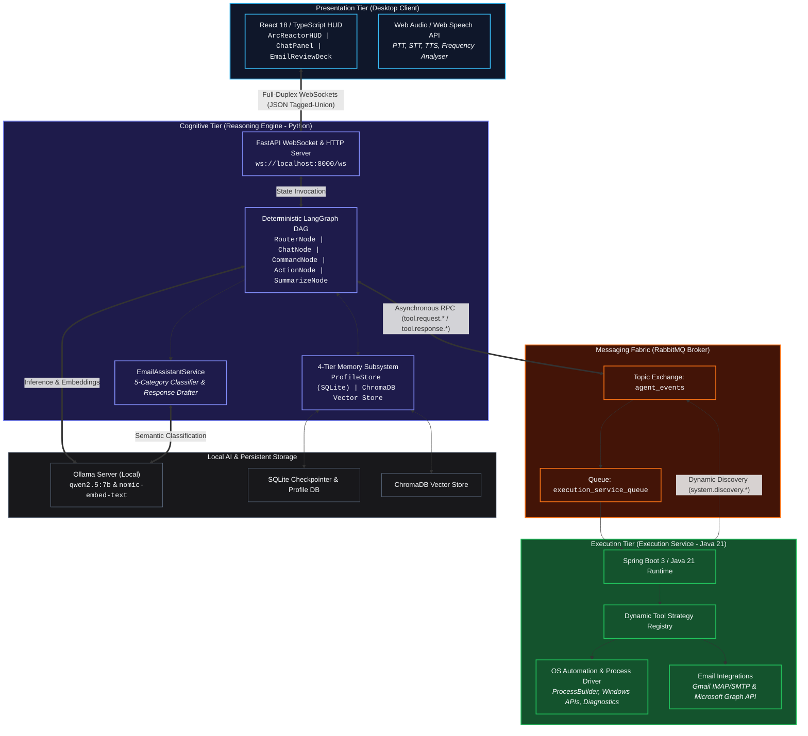

# JARVIS: Autonomous Agentic Desktop Assistant

[](docs/architecture/system-architecture.md)
[](reasoning-engine/)
[](execution-service/)
[](desktop-client/)
[](docs/messaging/rabbitmq-spec.md)
[](https://ollama.ai)

**JARVIS** is an enterprise-grade, distributed, autonomous agentic desktop assistant engineered for local operating system automation, intelligent workspace telemetry, bidirectional voice orchestration, persistent semantic memory, and Human-in-the-Loop (HITL) supervised workflow execution.

Built upon strict **Clean Architecture**, **Microservices Separation of Concerns**, and **Asynchronous Message-Driven Architecture**, the system cleanly separates probabilistic cognitive reasoning (Python/LLM) from deterministic host operating system mutation (Java/Spring Boot) and rich user presentation (React/TypeScript).

---

## 1. High-Level Architecture Overview

The system operates across three polyglot subsystem tiers interconnected via asynchronous AMQP message fabric and full-duplex WebSocket channels:



---

## 2. Core Capabilities

* **Multi-Account Email Management**: Ingestion across Gmail (IMAP) and Microsoft 365 (Graph API), automatic 5-category classification (`URGENT`, `UNIVERSITY`, `NOTIFICATION`, `NOT IMPORTANT`, `SPAM`), deterministic RFC-822 recipient validation, and supervised on-demand AI response drafting.
* **Bidirectional Voice Orchestration**: Push-to-Talk (PTT) with configurable hotkeys, real-time speech-to-text (STT), OS-level speech synthesis (TTS), and audio barge-in interruption.
* **Operating System Automation**: Defensive, sandboxed execution of Windows host actions via the Java execution service with strict process protection blacklists and shell-injection filters.
* **Human-in-the-Loop (HITL) Security**: Real-time interception and required user authorization for state-mutating or high-impact actions (`matar_proceso`, `enviar_correo_electronico`).
* **Cognitive Orchestration & Memory Hierarchy**: LangGraph DAG for deterministic routing and tool invocation, backed by a 4-tier memory subsystem (SQLite profile store, working memory buffer, ChromaDB vector search, and asynchronous background consolidation).

### Registered System Tools

| Tool | Critical (HITL) | Target Provider | Description |
| :--- | :---: | :--- | :--- |
| `consultar_correos_no_leidos` | No | JavaMail / Graph API | Fetches and parses unread messages across configured accounts. |
| `enviar_correo_electronico` | **Yes** | SMTP / Graph API | Dispatches emails with RFC-822 verified recipient grounding. |
| `matar_proceso` | **Yes** | `taskkill.exe` | Terminates host processes while protecting infrastructure processes. |
| `analizar_rendimiento_procesos` | No | `powershell.exe` | Queries top resource-consuming processes by CPU and memory. |
| `escanear_puerto` | No | `netstat.exe` | Scans and verifies active listening network ports. |
| `abrir_sitio_web` | No | OS Shell | Opens validated HTTP/HTTPS URLs in the default browser. |

---

## 3. Subsystem Architecture

### 3.1 [Desktop Client (`desktop-client/`)](desktop-client/)
* **Stack**: React 18, TypeScript, Vite, Web Audio API, Web Speech API, Lucide Icons.
* **Aesthetics**: High-contrast cybernetic HUD, glassmorphism, responsive 3-column workspace layout.
* **Key Components**: [`ArcReactorHUD.tsx`](desktop-client/src/components/ArcReactorHUD.tsx), [`EmailReviewDeck.tsx`](desktop-client/src/components/EmailReviewDeck.tsx), [`ChatPanel.tsx`](desktop-client/src/components/ChatPanel.tsx), [`HeaderHUD.tsx`](desktop-client/src/components/HeaderHUD.tsx), [`ConfirmationModal.tsx`](desktop-client/src/components/ConfirmationModal.tsx).

### 3.2 [Reasoning Engine (`reasoning-engine/`)](reasoning-engine/)
* **Stack**: Python 3.11, FastAPI, LangGraph, LangChain, SQLite (`aiosqlite`), ChromaDB, Pydantic v2.
* **Key Components**: [`agent.py`](reasoning-engine/agent/agent.py), [`email_service.py`](reasoning-engine/agent/email_service.py), [`prompts.py`](reasoning-engine/agent/prompts.py), [`api/websockets.py`](reasoning-engine/api/websockets.py).

### 3.3 [Execution Service (`execution-service/`)](execution-service/)
* **Stack**: Java 21, Spring Boot 3.4, Spring AMQP, ProcessBuilder, JavaMail, Microsoft Graph SDK.
* **Key Components**: [`ToolRegistryBroadcaster.java`](execution-service/src/main/java/com/agentic/execution_service/service/ToolRegistryBroadcaster.java), [`ExecutionListener.java`](execution-service/src/main/java/com/agentic/execution_service/service/ExecutionListener.java), [`EmailAccountManager.java`](execution-service/src/main/java/com/agentic/execution_service/service/email/EmailAccountManager.java).

### 3.4 [Message Bus Fabric (`docs/messaging/`)](docs/messaging/rabbitmq-spec.md)
* **Stack**: RabbitMQ 3.13 (Docker containerized) with AMQP 0-9-1.
* **Topology**: Topic Exchange (`agent_events`), Direct Correlation RPC (`correlationId`), Dead Letter Queues (DLQ).

---

## 4. Repository Directory Structure

```
agentic-desktop-assistant/
├── desktop-client/                  # React 18 / TypeScript HUD frontend
│   ├── src/
│   │   ├── components/              # ArcReactorHUD, EmailReviewDeck, ChatPanel, HeaderHUD, etc.
│   │   ├── hooks/                   # useVoice (STT, TTS, PTT, Audio Analysis)
│   │   ├── services/                # websocket.ts, notifications.ts, audioFeedback.ts
│   │   ├── types.ts                 # Strongly-typed TypeScript interfaces
│   │   └── App.tsx                  # Root HUD container and state coordinator
│   ├── package.json
│   └── vite.config.ts
│
├── reasoning-engine/                # Python 3.11 cognitive core & LangGraph orchestrator
│   ├── agent/                       # Graph nodes, routing, email_service, and memory
│   │   ├── memory/                  # 4-tier memory subsystem (Profile, Vector, Async)
│   │   ├── nodes/                   # RouterNode, CommandNode, ActionNode, SummarizeNode
│   │   ├── email_service.py         # Semantic classification & draft creation
│   │   ├── email_models.py          # Email data contracts and payloads
│   │   └── prompts.py               # Centralized system prompts & directives
│   ├── api/                         # FastAPI WebSocket router (api/websockets.py)
│   ├── services/                    # ConnectionManager, ConfirmationManager, RabbitMQListener
│   ├── tests/                       # Unit & integration pytest suite (57 tests)
│   ├── main.py                      # Application entry point
│   └── pyproject.toml / requirements.txt
│
├── execution-service/               # Java 21 / Spring Boot OS execution microservice
│   ├── src/main/java/com/agentic/execution_service/
│   │   ├── config/                  # RabbitMQ, Email, and System properties
│   │   ├── models/                  # EventEnvelope, ToolDefinition, EmailMessageDTO
│   │   ├── service/email/           # EmailAccountManager, MicrosoftGraphService, MimeParser
│   │   ├── tools/                   # Dynamic AgentTool implementations (Process, Mail, Shell)
│   │   └── ExecutionServiceApplication.java
│   ├── src/test/java/               # JUnit 5 & Mockito test suite
│   └── pom.xml
│
├── docs/                            # Formal System Documentation
│   ├── architecture/                # System architecture, email flow, WebSocket specs
│   ├── adr/                         # Architecture Decision Records (ADR-001 to ADR-010)
│   └── messaging/                   # Canonical RabbitMQ AMQP specification
│
├── docker-compose.yml               # Local infrastructure (RabbitMQ with Management Plugin)
├── iniciar_entorno.ps1              # Automated Windows environment launcher
└── pyrefly.toml                     # Pyrefly linting & typechecker configuration
```

---

## 5. Architectural Specifications & Decision Records

Detailed engineering specifications and design rationales are maintained under [`docs/`](docs/):

* **System Architecture Specification**: [docs/architecture/system-architecture.md](docs/architecture/system-architecture.md)
* **Intelligent Email Subsystem Architecture**: [docs/architecture/email-subsystem-architecture.md](docs/architecture/email-subsystem-architecture.md)
* **WebSocket Protocol Specification**: [docs/architecture/websocket-protocol-spec.md](docs/architecture/websocket-protocol-spec.md)
* **RabbitMQ Messaging Specification**: [docs/messaging/rabbitmq-spec.md](docs/messaging/rabbitmq-spec.md)
* **Architecture Decision Records (ADRs)**:
  * [ADR-001: Polyglot Microservices Separation of Concerns](docs/adr/ADR-001-polyglot-microservices-separation-of-concerns.md)
  * [ADR-002: Asynchronous RPC via Message Bus for Inter-Service Communication](docs/adr/ADR-002-inter-service-communication-pattern.md)
  * [ADR-003: Deterministic Directed Acyclic Graph (DAG) for Cognitive Orchestration](docs/adr/ADR-003-cognitive-engine-topology.md)
  * [ADR-004: Four-Tier Memory Architecture with Debounced Async Consolidation](docs/adr/ADR-004-four-tier-memory-architecture-without-contention.md)
  * [ADR-005: Dynamic Tool Discovery via Registry Broadcast and Strategy Pattern](docs/adr/ADR-005-dynamic-tool-discovery-and-strategy-pattern.md)
  * [ADR-006: Inversion of Control Runtime Container and Bidirectional WebSocket State](docs/adr/ADR-006-lifecycle-inversion-of-control-bidirectional-state.md)
  * [ADR-007: Distributed Tracing and Asynchronous Observability](docs/adr/ADR-007-distributed-tracing-and-asynchronous-observability.md)
  * [ADR-008: Cascaded Audio Transducers vs. Native End-to-End Multimodal Audio LLMs](docs/adr/ADR-008-cascaded-audio-transducers-vs-native-audio-llm.md)
  * [ADR-009: Human-in-the-Loop Safeguard Architecture for Critical OS Tools](docs/adr/ADR-009-human-in-the-loop-safeguard-architecture.md)
  * [ADR-010: Intelligent Email Assistant & Supervised Dispatch Architecture](docs/adr/ADR-010-intelligent-email-assistant-architecture.md)

---

## 6. Getting Started & Development Workflow

### 6.1 Prerequisites
* **Operating System**: Windows 10/11 (for native process management and OS audio APIs).
* **Docker Desktop**: Running with WSL2 backend.
* **Ollama**: Installed and running locally with models `qwen2.5:7b` and `nomic-embed-text`.
* **Python**: v3.11.x.
* **Java Development Kit (JDK)**: OpenJDK 21 or Eclipse Temurin 21.
* **Node.js**: v18.x or v20.x with npm v9+.

### 6.2 Environment Setup & Launch

#### 1. Start Infrastructure (Docker & Ollama)
```powershell
# Start RabbitMQ container
docker-compose up -d

# Verify / pull Ollama models
ollama pull qwen2.5:7b
ollama pull nomic-embed-text
```

#### 2. Start Java Execution Service
```powershell
cd execution-service
./mvnw spring-boot:run
```

#### 3. Start Python Reasoning Engine
```powershell
cd reasoning-engine
.\.venv\Scripts\Activate.ps1
pip install -r requirements.txt
python main.py
```

#### 4. Start React Desktop Client
```powershell
cd desktop-client
npm install
npm run dev
```

> [!TIP]
> You can also run `.\iniciar_entorno.ps1` from PowerShell to verify Docker and Ollama availability automatically.

---

## 7. Verification & Test Execution

The codebase enforces comprehensive automated test suites across all tiers:

```powershell
# 1. Run Python Unit & Integration Tests (pytest)
cd reasoning-engine
.\.venv\Scripts\python.exe -m pytest

# 2. Run Java Unit & Service Tests (Maven / JUnit 5)
cd execution-service
./mvnw test

# 3. Validate TypeScript Types & Frontend Production Build
cd desktop-client
npm run build
```

---

## 8. License & Engineering Governance

This project is structured for academic, research, and enterprise desktop automation engineering. All contributions must adhere to clean architecture standards, preserve backward-compatible contracts, and update corresponding Architecture Decision Records (ADRs) and architectural documentation.
