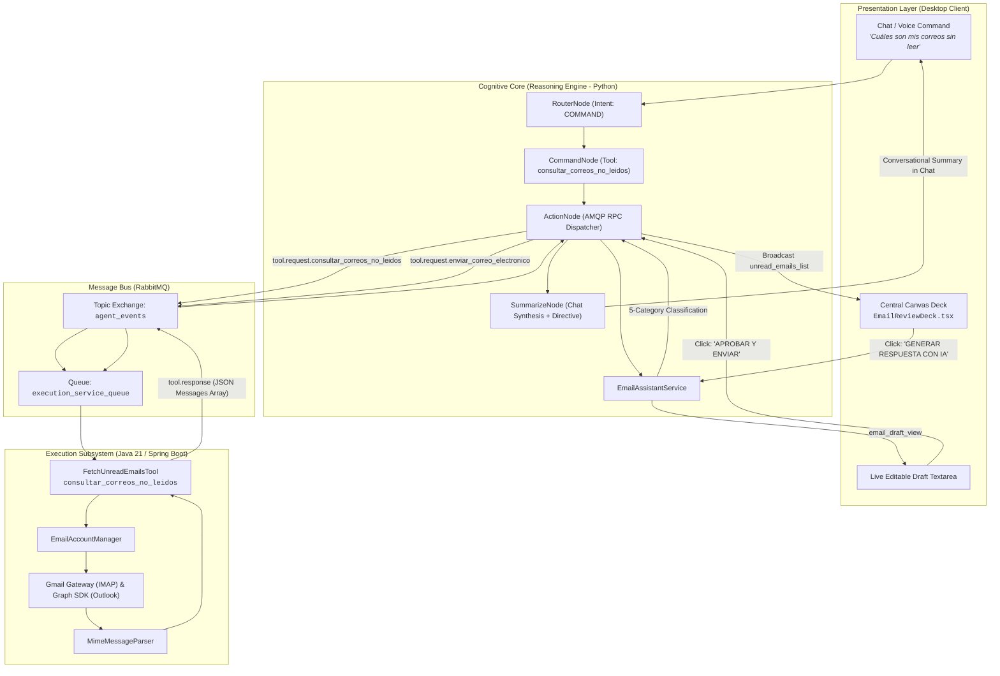
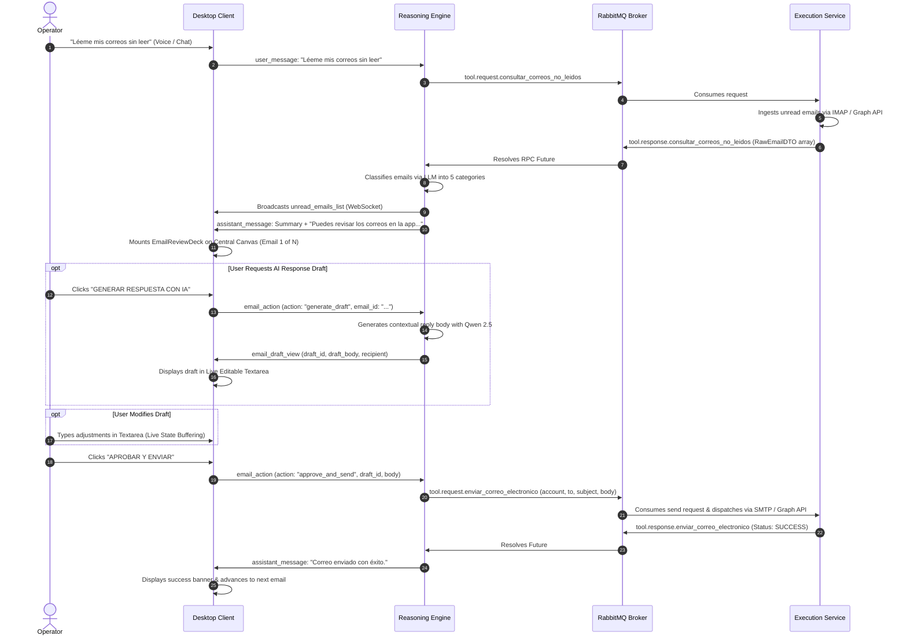

# Intelligent Email Subsystem Architecture Specification

## 1. Executive Summary & Design Objectives

The **Intelligent Email Subsystem** provides autonomous, multi-account email ingestion, semantic classification, anti-hallucinatory recipient resolution, and interactive Human-in-the-Loop response generation for the JARVIS Agentic Desktop Assistant.

Traditional AI assistants often risk accidental message dispatch or hallucinated email addresses. The JARVIS email architecture enforces **three fundamental pillars**:
1. **Deterministic Recipient Grounding (RFC-822)**: The recipient email address and name are hardcoded strictly from the immutable original MIME headers (`Reply-To` / `From`), guaranteeing that the LLM cannot hallucinate destination addresses.
2. **Interactive Central Canvas Deck**: Unread emails are rendered directly on the HUD's central canvas with seamless carousel navigation, category badges, full body rendering, and one-click AI draft generation.
3. **Supervised Live Editing & Human Authorization**: Drafts generated by the LLM are loaded into a real-time editable textarea, allowing the operator to modify, refine, discard, or approve the email before physical transmission.

---

## 2. End-to-End Architectural Data Flow



---

## 3. Five-Category Semantic Classification Taxonomy

Incoming emails retrieved by `FetchUnreadEmailsTool` are categorized by `EmailAssistantService` into a 5-category taxonomy:

| Category | Description | Criteria & Examples | Urgency Level | Auto-Draft Trigger |
| :--- | :--- | :--- | :--- | :--- |
| **`URGENT`** | Critical business blockers, production outages, or tight deadlines. | Server down alerts, security incidents, immediate client escalations. | High (4-5) | Yes (`requires_reply: true`) |
| **`UNIVERSITY`** | Academic announcements, professor notices, exam reviews, thesis coordination. | `.edu` / `.es` domains, course deadlines, grade publications. | Medium-High (3-4) | Yes (`requires_reply: true`) |
| **`NOTIFICATION`** | Automated service alerts and security digests. | GitHub PRs, Docker Hub, Stripe receipts, password reset receipts. | Low-Medium (2-3) | No (`requires_reply: false`) |
| **`NOT IMPORTANT`**| Informational mailings, general newsletters, or correspondence with no pending action. | Company-wide announcements, product updates. | Low (1-2) | No (`requires_reply: false`) |
| **`SPAM`** | Unsolicited marketing, promotional blasts, or phishing attempts. | Marketing discounts, clickbait offers, unknown commercial solicitations. | Lowest (1) | No (`requires_reply: false`) |

---

## 4. Deterministic Recipient Grounding (Zero-Hallucination Security)

> [!SECURITY]
> **Zero-Hallucination Guarantee**:
> In `EmailAssistantService.create_draft()`, the destination address is strictly resolved by code:
> ```python
> recipient_email = email.reply_to_address if email.reply_to_address else email.from_address
> recipient_name = email.from_name if email.from_name else recipient_email.split("@")[0]
> subject_reply = email.subject if email.subject.lower().startswith("re:") else f"Re: {email.subject}"
> ```
> The LLM prompt is restricted to generating the message body (`draft_body`). It is prevented from fabricating header fields or recipient email addresses.

---

## 5. End-to-End WebSocket & AMQP Interaction Sequence



---

## 6. Formal Data Contracts & Schema Definitions

### 6.1 `EmailItem` (Frontend Domain Model)

```typescript
export interface EmailItem {
  id: string;
  account: 'GMAIL' | 'OUTLOOK' | string;
  account_address: string;
  subject: string;
  from_name: string;
  from_address: string;
  reply_to_address: string;
  to_addresses?: string[];
  cc_addresses?: string[];
  received_at: string;
  body_snippet: string;
  body_text: string;
  has_attachments?: boolean;
  attachment_names?: string[];
  category: 'URGENT' | 'UNIVERSITY' | 'NOTIFICATION' | 'NOT IMPORTANT' | 'SPAM';
  urgency_score: number; // 1 to 5
  requires_reply?: boolean;
  suggested_action?: string;
  draft?: {
    draft_id: string;
    draft_body: string;
    is_generating?: boolean;
    created_at?: string;
  };
}
```

### 6.2 `unread_emails_list` (WebSocket Event)

```json
{
  "type": "unread_emails_list",
  "total": 2,
  "emails": [
    {
      "id": "<msg-4928@gmail.com>",
      "account": "GMAIL",
      "account_address": "user@gmail.com",
      "subject": "Revisión de Proyecto de Inteligencia Artificial",
      "from_name": "Prof. Alejandro Ruiz",
      "from_address": "aruiz@universidad.es",
      "reply_to_address": "aruiz@universidad.es",
      "to_addresses": ["user@gmail.com"],
      "received_at": "2026-09-29T17:15:00Z",
      "body_snippet": "Estimado alumno, por favor confirme su disponibilidad para el viernes a las 11:00...",
      "body_text": "Estimado alumno, por favor confirme su disponibilidad para la revisión presencial del viernes a las 11:00 en el despacho 204.",
      "has_attachments": false,
      "attachment_names": [],
      "category": "UNIVERSITY",
      "urgency_score": 4,
      "requires_reply": true,
      "suggested_action": "Confirmar asistencia a la reunión presencial"
    }
  ]
}
```

---

## 7. Failure Modes & Graceful Degradation

1. **Unconfigured Accounts**:
   * If credentials are missing in `application.properties`, `FetchUnreadEmailsTool` returns `{"total": 0, "mensajes": [], "aviso": "..."}` without throwing fatal exceptions.
2. **Corrupted / Truncated MIME Messages**:
   * `MimeMessageParser` provides robust fallbacks for multipart headers, encoding anomalies, and HTML-to-plaintext conversion.
3. **LLM Generation Timeouts**:
   * If Ollama encounters latency while generating a draft, `EmailAssistantService` provides a polite fallback draft while maintaining locked RFC-822 recipient metadata.
