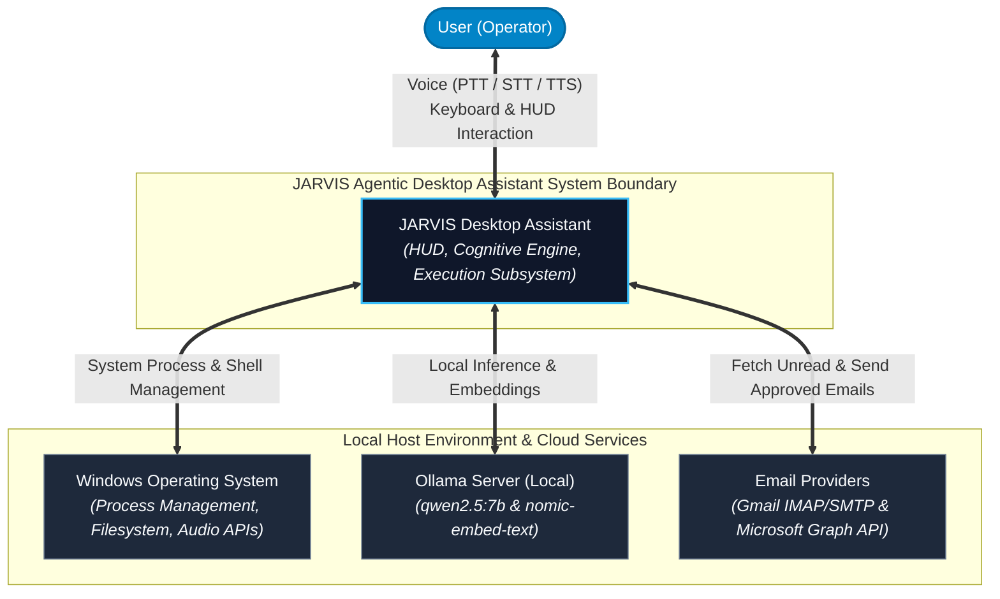
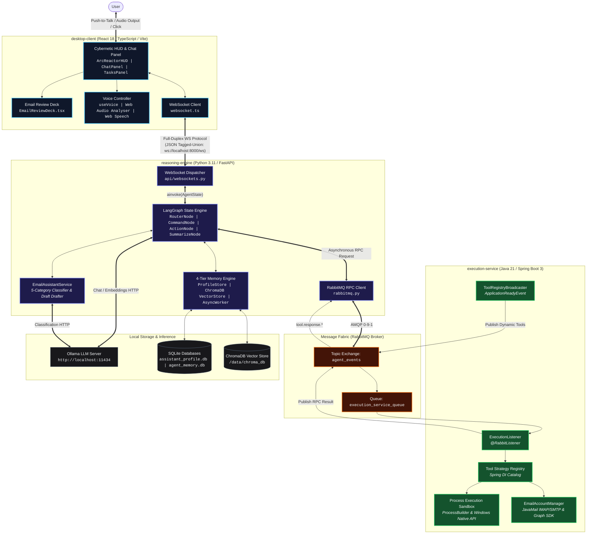
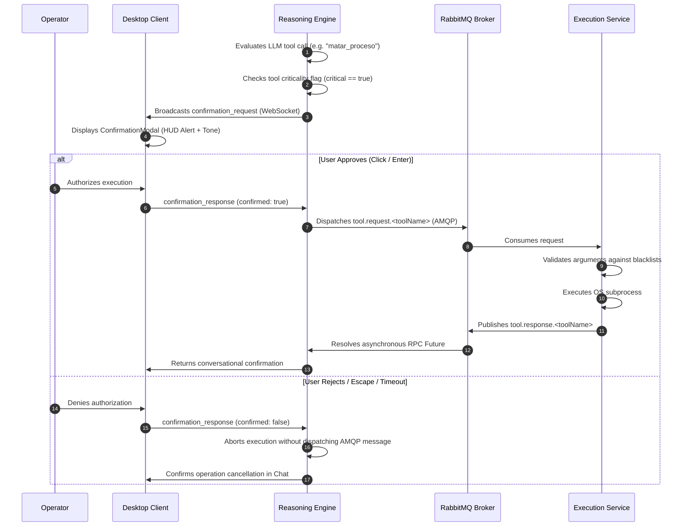

# JARVIS System Architecture Specification

## 1. Executive Summary & System Vision

**JARVIS** is an enterprise-grade, distributed desktop assistant engineered to execute autonomous cognitive reasoning, local operating system automation, intelligent workspace telemetry, and voice-assisted workflow execution on Windows host systems.

The architecture is governed by strict **Microservices Separation of Concerns**, **Clean Architecture**, and **Asynchronous Message-Driven Coordination**. By isolating high-level probabilistic reasoning (Python/LLM) from low-level deterministic operating system mutation (Java/Spring Boot) and rich user presentation (React/TypeScript), JARVIS provides strong reliability, sandboxed execution boundaries, zero process collision, and sub-second voice/HUD response latency.

---

## 2. Architectural Principles & Quality Attributes

1. **Polyglot Isolation of Concerns**:
   * *Cognitive Reasoning & Memory*: Python 3.11 with LangGraph and ChromaDB excels at vector manipulation, prompt graph topologies, and conversational AI.
   * *OS Automation & Deterministic Drivers*: Java 21 with Spring Boot provides robust type safety, robust subprocess isolation, connection pooling, and multi-threaded throughput.
   * *HUD Presentation*: React 18 with TypeScript and Vite provides hardware-accelerated Web Audio/Speech integration, glassmorphism aesthetics, and real-time state visualization.
2. **Asynchronous Message-Driven Coordination**:
   * All inter-service commands and data transfers between the cognitive core and execution subsystem occur over a high-throughput RabbitMQ message bus using asynchronous Remote Procedure Calls (RPC) with explicit correlation identifiers.
3. **Zero-Trust Host Execution with Human-in-the-Loop (HITL)**:
   * Non-idempotent or destructive actions (such as process termination, system modifications, or email transmission) require explicit interactive user authorization via the Desktop Client before OS execution.
4. **Resilient Four-Tier Memory**:
   * Retains user preferences, working dialogue context, and long-term semantic knowledge without blocking foreground inference turns or exhausting model context windows.

---

## 3. C4 Architecture Blueprint

### 3.1 C4 Level 1: System Context Diagram

---

### 3.2 C4 Level 2: Container Diagram (Distributed Microservices)

---

## 4. Subsystem Specifications

### 4.1 Presentation Layer (`desktop-client`)
* **Framework**: React 18, TypeScript, Vite.
* **Component Hierarchy**:
  * `App.tsx`: Central coordinator managing active tabs, WebSocket event dispatching, global hotkeys, and voice lifecycles.
  * `HeaderHUD.tsx`: System telemetry (online/offline status, connected tools counter, digital clock, microphone mode indicator).
  * `ChatPanel.tsx`: Resizable conversation log supporting Markdown formatting, streaming interim transcripts, and dynamic Stop/Send controls.
  * `EmailReviewDeck.tsx`: Central interactive canvas displaying unread emails, category badges, RFC-822 verified recipients, AI draft generation, real-time draft editing, and one-click dispatch.
  * `ArcReactorHUD.tsx`: Concentric orbital holographic reactor visualizing 4 assistant states (`IDLE`, `LISTENING`, `THINKING`, `SPEAKING`).
  * `ConfirmationModal.tsx`: High-contrast modal intercepting critical tool calls for user authorization.
  * `SettingsView.tsx`: User configuration view for voice synthesis selection, PTT modes, model parameters, and hotkey bindings.

---

### 4.2 Cognitive Core (`reasoning-engine`)
* **State Machine Topology**: Directed acyclic graph (DAG) constructed using LangGraph with an `AsyncSqliteSaver` checkpointer.
* **Nodes**:
  1. `RouterNode`: Evaluates user intent using semantic classification (`CHAT` vs `COMMAND`). If `COMMAND`, queries `VectorMemoryStore` for relevant semantic memories.
  2. `ChatNode`: Generates polite, natural conversational responses without technical tool invocation.
  3. `CommandNode`: Discovers registered tools dynamically and invokes structured tool calls matching user intent.
  4. `ActionNode`: Intercepts critical tools for Human-in-the-Loop confirmation, executes non-blocking RPC across RabbitMQ, and dispatches unread email lists and drafts to the frontend.
  5. `SummarizeNode`: Translates raw tool execution output into concise conversational responses, concluding email reviews with clear reminders regarding the central application deck.
* **Memory Subsystem**:
  * **Tier 0 (ProfileStore)**: Relational SQLite storage for user personal data and configuration.
  * **Tier 1 (Working Memory)**: Token-budgeted dialogue buffer using `tiktoken`.
  * **Tier 2 (VectorMemoryStore)**: ChromaDB semantic vector store using cosine similarity over `nomic-embed-text` embeddings.
  * **Tier 3 (AsyncMemoryManager)**: Asynchronous background memory extractor operating on a 45-second debounce worker.

---

### 4.3 Execution Subsystem (`execution-service`)
* **Framework**: Java 21, Spring Boot 3.4.
* **Key Components**:
  * `ToolRegistry`: In-memory strategy registry populated on startup via Spring component scanning (`AgentTool` interface).
  * `ToolRegistryBroadcaster`: Publishes tool definitions and parameter JSON Schemas to `system.discovery.execution_service` upon `ApplicationReadyEvent`.
  * `ExecutionListener`: `@RabbitListener` consuming from `execution_service_queue` matching `tool.request.*`.
  * `ProcessEngine`: Sandboxed execution of host processes with hard execution timeouts (default: 30s) and infrastructure termination blacklists.
  * `EmailAccountManager`: Multi-provider email management engine supporting Gmail IMAP/SMTP and Microsoft 365 Graph REST API.

---

## 5. Security & Human-in-the-Loop Safeguards

---

## 6. Resilience & Fault Tolerance

1. **Broker Reconnection & Offline Readiness**:
   * If RabbitMQ is unavailable during startup, both `reasoning-engine` and `execution-service` log clear warnings and continue operating local memory and API surfaces without crashing.
   * `desktop-client` auto-reconnects to WebSockets with exponential backoff.
2. **Deterministic RPC Future Resolution**:
   * All AMQP messages carry a unique `correlationId`. Unmatched or timed-out responses are cleanly rejected after 30 seconds without hanging Python event loops.
3. **Dead Letter Queue (DLQ) Poison Pill Isolation**:
   * Malformed payloads or unhandled runtime exceptions are routed to `agent_events.dlq` without blocking the main execution queue.
