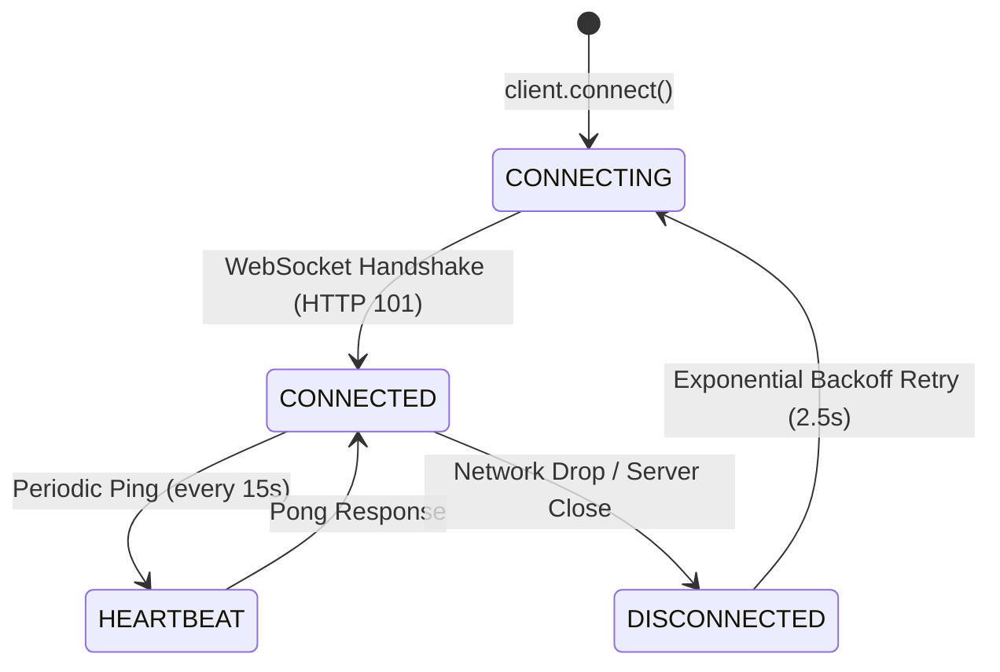

# JARVIS WebSocket Protocol Specification

## 1. Protocol Overview & Connection Lifecycle

The **JARVIS WebSocket Protocol** provides full-duplex, low-latency, event-driven communication between the **Desktop Client** (`desktop-client/`) and the **Reasoning Engine** (`reasoning-engine/`).

* **Endpoint URL**: `ws://localhost:8000/ws`
* **Transport**: WebSocket (RFC 6455) over TCP
* **Message Framing**: UTF-8 encoded text frames containing strictly typed JSON objects.
* **Discriminator**: Every payload MUST include a root `"type"` string key identifying the event type (Tagged Union / Discriminated Union pattern).



---

## 2. Inbound Events (Client to Server)

### 2.1 `user_message`
Dispatches a user input (typed or voice-transcribed) to the cognitive orchestrator.

```json
{
  "type": "user_message",
  "content": "¿Cuáles son mis correos sin leer?"
}
```

### 2.2 `email_action`
Triggers interactive actions against the email subsystem (draft generation, approval/sending, discard).

#### Action A: Generate Draft On-Demand (`generate_draft`)
```json
{
  "type": "email_action",
  "action": "generate_draft",
  "email_id": "<msg-4928@gmail.com>",
  "account": "GMAIL",
  "instructions": "Confirmar que asistiré a la reunión de mañana a las 11:00",
  "email": {
    "id": "<msg-4928@gmail.com>",
    "account": "GMAIL",
    "account_address": "user@gmail.com",
    "subject": "Revisión de Proyecto",
    "from_name": "Prof. Alejandro Ruiz",
    "from_address": "aruiz@universidad.es",
    "reply_to_address": "aruiz@universidad.es",
    "body_text": "Estimado alumno, confirme su disponibilidad...",
    "category": "UNIVERSITY",
    "urgency_score": 4
  }
}
```

#### Action B: Approve and Send Email (`approve_and_send`)
```json
{
  "type": "email_action",
  "action": "approve_and_send",
  "draft_id": "draft-a9f201bc",
  "email_id": "<msg-4928@gmail.com>",
  "account": "GMAIL",
  "recipient": "aruiz@universidad.es",
  "subject": "Re: Revisión de Proyecto",
  "body": "Estimado Profesor Ruiz,\n\nLe confirmo que asistiré este viernes a las 11:00.\n\nAtentamente,\nJose"
}
```

#### Action C: Discard Draft (`discard_draft`)
```json
{
  "type": "email_action",
  "action": "discard_draft",
  "draft_id": "draft-a9f201bc",
  "email_id": "<msg-4928@gmail.com>"
}
```

---

### 2.3 `confirmation_response`
Resolves a pending Human-in-the-Loop authorization request for a critical OS tool.

```json
{
  "type": "confirmation_response",
  "confirmation_id": "conf-89bc3a01-4421-4f7d-8ae5",
  "confirmed": true
}
```

---

### 2.4 `stop`
Cancels active LangGraph reasoning execution and aborts pending confirmation requests.

```json
{
  "type": "stop"
}
```

---

### 2.5 `clear_history`
Clears conversation history checkpoints in SQLite (`agent_memory.db`) for the active thread.

```json
{
  "type": "clear_history"
}
```

---

### 2.6 `ping`
Heartbeat probe sent by the client every 15 seconds.

```json
{
  "type": "ping"
}
```

---

## 3. Outbound Events (Server to Client)

### 3.1 `connected`
Dispatched immediately upon successful WebSocket handshake.

```json
{
  "type": "connected",
  "message": "Sistemas de J.A.R.V.I.S en línea y listos para interactuar.",
  "tools": [
    "consultar_correos_no_leidos",
    "enviar_correo_electronico",
    "matar_proceso",
    "diagnostico_sistema"
  ]
}
```

---

### 3.2 `status`
Synchronizes the assistant's cognitive state (`THINKING` vs `IDLE`).

```json
{
  "type": "status",
  "state": "THINKING"
}
```

---

### 3.3 `assistant_message`
Delivers the synthesized conversational response.

* `content`: Full Markdown-rendered text for the chat panel.
* `speech_text`: Cleaned phonetic text formatted for TTS audio playback.

```json
{
  "type": "assistant_message",
  "content": "He encontrado 2 correos sin leer. Tienes un aviso urgente de la universidad y una notificación de GitHub.\n\nPuedes revisar los correos completos en mi aplicación. Si lo deseas, también puedes hacer que genere una respuesta automática directamente desde la app para editarla y enviarla, o pedírmelo aquí.",
  "speech_text": "He encontrado 2 correos sin leer. Tienes un aviso urgente de la universidad y una notificación de GitHub. Puedes revisar los correos completos en mi aplicación."
}
```

---

### 3.4 `unread_emails_list`
Dispatches the collection of ingested unread emails to the client's central interactive deck.

```json
{
  "type": "unread_emails_list",
  "total": 2,
  "emails": [
    {
      "id": "<msg-4928@gmail.com>",
      "account": "GMAIL",
      "account_address": "user@gmail.com",
      "subject": "Revisión de Proyecto",
      "from_name": "Prof. Alejandro Ruiz",
      "from_address": "aruiz@universidad.es",
      "reply_to_address": "aruiz@universidad.es",
      "to_addresses": ["user@gmail.com"],
      "received_at": "2026-09-29T17:15:00Z",
      "body_snippet": "Estimado alumno, confirme su disponibilidad...",
      "body_text": "Estimado alumno, confirme su disponibilidad para el viernes a las 11:00.",
      "has_attachments": false,
      "attachment_names": [],
      "category": "UNIVERSITY",
      "urgency_score": 4,
      "requires_reply": true,
      "suggested_action": "Confirmar asistencia a la reunión presencial"
    }
  ]
}
```

---

### 3.5 `email_draft_view`
Dispatches a newly generated AI response draft for a specific email.

```json
{
  "type": "email_draft_view",
  "draft_id": "draft-a9f201bc",
  "original_message_id": "<msg-4928@gmail.com>",
  "account": "GMAIL",
  "account_address": "user@gmail.com",
  "recipient_name": "Prof. Alejandro Ruiz",
  "recipient_email": "aruiz@universidad.es",
  "subject": "Re: Revisión de Proyecto",
  "original_snippet": "Estimado alumno, confirme su disponibilidad...",
  "draft_body": "Estimado Profesor Ruiz,\n\nMuchas gracias por el aviso. Le confirmo que asistiré este viernes a las 11:00 a su despacho.\n\nUn cordial saludo,\nJose",
  "category": "UNIVERSITY",
  "urgency_score": 4,
  "created_at": "2026-09-29T17:15:30Z"
}
```

---

### 3.6 `confirmation_request`
Prompts the desktop client to display a Human-in-the-Loop authorization modal for a critical tool.

```json
{
  "type": "confirmation_request",
  "confirmation_id": "conf-89bc3a01-4421-4f7d-8ae5",
  "tool_name": "matar_proceso",
  "arguments": {
    "nombre_proceso": "chrome.exe"
  },
  "title": "Confirmación de Acción: Terminar Proceso",
  "message": "¿Desea autorizar el cierre forzado del proceso 'chrome.exe'?",
  "severity": "CRITICAL",
  "target": "chrome.exe",
  "details": {
    "nombre_proceso": "chrome.exe"
  }
}
```

---

### 3.7 `pong`
Acknowledges client heartbeat probe.

```json
{
  "type": "pong"
}
```

---

## 4. Summary Event Mapping

| Event Discriminator | Direction | Payload Schema / Model | Description |
| :--- | :--- | :--- | :--- |
| `user_message` | Client -> Server | `{ type, content }` | Dispatches user prompt to LangGraph. |
| `email_action` | Client -> Server | `EmailActionPayload` | Executes draft generation, sending, or discard. |
| `confirmation_response` | Client -> Server | `ConfirmationResponsePayload` | Resolves critical tool authorization future. |
| `stop` | Client -> Server | `{ type }` | Cancels active reasoning graph. |
| `clear_history` | Client -> Server | `{ type }` | Resets conversation thread state. |
| `ping` | Client -> Server | `{ type }` | Client keep-alive probe. |
| `connected` | Server -> Client | `{ type, message, tools }` | Handshake acknowledgment. |
| `status` | Server -> Client | `{ type, state }` | Synchronizes assistant state (`THINKING`/`IDLE`). |
| `assistant_message` | Server -> Client | `{ type, content, speech_text }` | Formatted response for chat & voice. |
| `unread_emails_list` | Server -> Client | `{ type, total, emails[] }` | Populates central interactive email deck. |
| `email_draft_view` | Server -> Client | `EmailDraftPayload` | AI response draft for editing & approval. |
| `email_draft_cleared` | Server -> Client | `{ type, draftId }` | Clears active draft from frontend memory. |
| `confirmation_request` | Server -> Client | `ConfirmationRequestPayload` | Triggers cybernetic HITL modal. |
| `pong` | Server -> Client | `{ type }` | Heartbeat probe response. |
