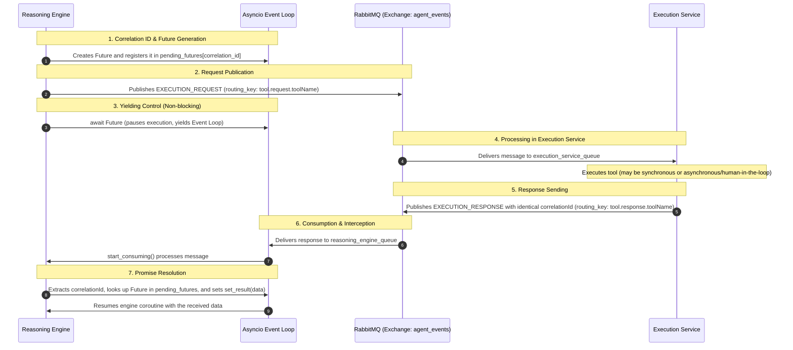
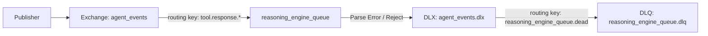

# RabbitMQ Messaging and Architecture Specification

This document details the network topology, event routing, synchronous/asynchronous communication flow (Async RPC), and the data contract utilized for communication between the reasoning engine and the execution service.

---

## 1. Topology and Connection

### Protocol and Resilience
Communication is carried out under the **AMQP 0-9-1** protocol. To mitigate network micro-outages and broker downtime, it is **mandatory** to use robust connections that automate reconnection and the restoration of channels and topology without manual intervention.

In the reasoning engine implementation ([rabbitmq.py](../../reasoning-engine/rabbitmq.py)), this is achieved using `aio_pika.connect_robust`:

```python
self.connection = await aio_pika.connect_robust(self.amqp_url)
self.channel = await self.connection.channel()
```

### Main Exchange
All inter-service messaging passes through a single central **Topic** exchange:
- **Name**: `agent_events`
- **Type**: `ExchangeType.TOPIC`
- **Durable**: `True` (survives RabbitMQ broker restarts)

```python
self.exchange = await self.channel.declare_exchange(
    name="agent_events", 
    type=aio_pika.ExchangeType.TOPIC,
    durable=True
)
```

### Queues and Binds

| Queue | Durability | Consumer | Subscribed Routing Keys | Purpose |
| :--- | :--- | :--- | :--- | :--- |
| `reasoning_engine_queue` | `Durable=True` | Reasoning Engine | `system.discovery.execution_service`<br>`tool.response.*` | Receive tool registration broadcasts and tool execution responses. |
| `execution_service_queue` | `Durable=True` | Execution Service | `tool.request.<tool_name>` | Receive tool execution requests for registered tools. |

> [!NOTE]
> Queues are declared with `durable=True` to guarantee persistence and consistency in case of broker failures.

---

## 2. Routing (Routing Keys)

The system leverages RabbitMQ's **Topic** pattern to achieve loose coupling between the sender and the receivers. Routing keys are structured following a semantic hierarchy:

| Routing Key | Source | Destination (Queue) | Purpose |
| :--- | :--- | :--- | :--- |
| `system.discovery.execution_service` | Execution Service | `reasoning_engine_queue` | Initial and dynamic registration of available tools in the system. |
| `tool.response.*` | Execution Service | `reasoning_engine_queue` | Return results or errors of tool executions back to the reasoning engine. |
| `tool.request.<name>` | Reasoning Engine | `execution_service_queue` | Asynchronous execution request sent to the specific tool named `<name>`. |

---

## 3. Architecture Pattern: Asynchronous RPC

To perform remote execution of tools without blocking main execution threads, an **Asynchronous RPC** (Remote Procedure Call) pattern is implemented via an in-memory correlation mechanism.

### `send_and_wait` Execution Flow
The process follows this sequence:



### Key Implementation Features
1. **Non-blocking**: By performing `await future` in the `send_and_wait` method (see [rabbitmq.py](../../reasoning-engine/rabbitmq.py#L60-L77)), the asyncio event loop remains free to process other incoming events or messages in parallel.
2. **No Timeout by Design**: The call intentionally omits a timeout to support tools that require manual confirmation or human-in-the-loop workflows, which can take minutes or hours.
3. **Memory Cleanup**: A `finally` block is used to guarantee that the correlation identifier is removed from the `pending_futures` dictionary, preventing memory leaks if the task is cancelled.

---

## 4. Data Contract (The "Envelope")

To guarantee interoperability between the reasoning engine and the execution service, a strict serialization schema is defined.

### Case Mapping (snake_case vs camelCase)
- The **Reasoning Engine** uses standard `snake_case` for internal variables.
- The **Execution Service** and the public API specification use `camelCase`.
- **Solution**: We define aliases in Pydantic models ([models.py](../../reasoning-engine/models.py)) combined with serialization using `by_alias=True` in Python.

```python
# Definition in models.py with aliases
class EventMetadata(BaseModel):
    event_id: str = Field(..., alias="eventId")
    correlation_id: str = Field(..., alias="correlationId")
    timestamp: int
    source: str
    event_type: EventType = Field(..., alias="eventType")

# Serialization in rabbitmq.py
json_payload = envelope.model_dump_json(by_alias=True)
```

### General Envelope JSON Structure

```json
{
  "metadata": {
    "eventId": "3c9b68e0-1c39-4d6e-9df2-5d9c72df894f",
    "correlationId": "8f3b23fa-08c3-4d7a-b9c1-7a6c2bb25dfb",
    "timestamp": 1788177600000,
    "source": "reasoning-engine",
    "eventType": "EXECUTION_REQUEST"
  },
  "payload": {
    "toolName": "openWebTool",
    "arguments": {
      "url": "https://www.google.com"
    }
  }
}
```

### Event Types Detail (`eventType`)

1. **`TOOL_REGISTRY_BROADCAST`**:
   Sent by the execution service at startup to broadcast available tools.
   - **Payload**: Dictionary containing tool definitions and metadata.

2. **`EXECUTION_REQUEST`**:
   Sent by the reasoning engine to request a tool execution.
   - **Payload** (`ToolExecutionRequestPayload`):
     - `toolName` (String, required)
     - `arguments` (Object, required)

3. **`EXECUTION_RESPONSE`**:
   Sent by the execution service with the tool execution result.
   - **Payload** (`ToolExecutionResponsePayload`):
     - `toolName` (String, required)
     - `status` (String, required)
     - `output` (String, optional)
     - `errorCode` (String, optional)

---

## 5. Error Handling and Lifecycle (IN PROGRESS)

To harden the architecture and ensure that transient or logical errors do not block the stream of data, strict message processing guidelines are applied.

### Acknowledgements (ACK/NACK) and Poison Pill Prevention
A common issue in queue-based systems is the **Poison Pill**: a malformed or corrupted message that arrives at the consumer, causes it to fail, is re-queued by default, and fails again in an infinite loop, blocking the entire queue.

To prevent this, the following logic is implemented in the consumption loop:

1. **Successful Message**: The message is successfully processed and acknowledged (`message.ack()`).
2. **Corrupted Payload (`JSONDecodeError`)**: If the message cannot be parsed as valid JSON, it is rejected immediately with **no re-queueing** (`requeue=False`).
3. **Handler Failure (`Exception` in callback)**: If callback execution fails due to issues beyond the message structure, the error is logged and the message is rejected with `requeue=False` for further auditing or routed to retry configurations.

> [!WARNING]
> A message with structural parsing errors (`JSONDecodeError`) must never be re-queued, as it would cause an infinite consumption failure loop (Poison Pill).

### Dead Letter Queue (DLQ) Topology
Messages rejected without re-queueing are not lost; they are automatically diverted to a "dead letter" queue so that operators or alert systems can analyze them.

1. **Dead Letter Exchange (DLX) Declaration**:
   A Topic exchange named `agent_events.dlx`.
2. **Dead Letter Queue (DLQ) Declaration**:
   A persistent queue named `reasoning_engine_queue.dlq`.
3. **Queue Configuration**:
   When declaring `reasoning_engine_queue`, the arguments `x-dead-letter-exchange` and `x-dead-letter-routing-key` are specified.



#### Proposed Main Queue Declaration Arguments:
```python
queue = await self.channel.declare_queue(
    "reasoning_engine_queue",
    durable=True,
    arguments={
        "x-dead-letter-exchange": "agent_events.dlx",
        "x-dead-letter-routing-key": "reasoning_engine_queue.dead"
    }
)
```

This ensures that any rejection (`message.reject(requeue=False)`) safely redirects the message to dead-letter storage (`reasoning_engine_queue.dlq`), keeping the main processing queue healthy and free of blocking messages.
