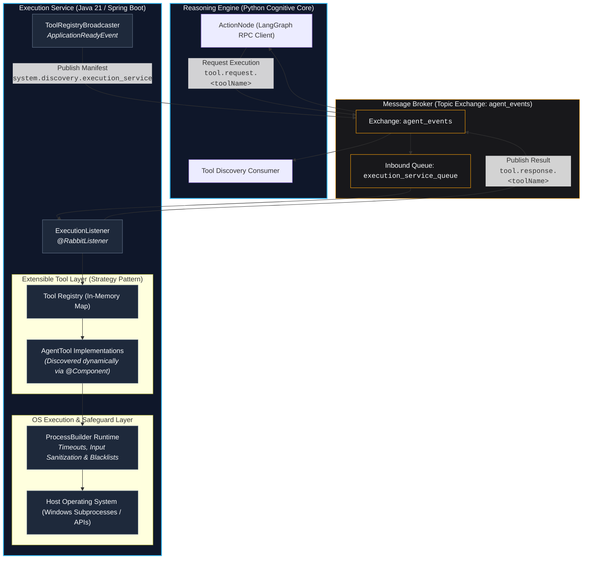

# JARVIS Execution Service (Operating System Automation Runtime)

The **Execution Service** is the low-level operating system automation microservice of the JARVIS Agentic Desktop Assistant. Built with **Java 21** and **Spring Boot**, it serves as a secure, sandboxed execution runtime that receives asynchronous tool execution commands from the cognitive core ([reasoning-engine](../reasoning-engine/)) via RabbitMQ, executes targeted OS actions, enforces security boundaries, and returns deterministic results.

---

## 1. Overview & System Role

In the JARVIS distributed architecture, the Execution Service decouples high-level cognitive decision-making from operating system interaction:

* **Zero-Configuration System Discovery**: Broadcasts available tool schemas, JSON Schema validation descriptors, safety criticality flags (`critical`), and confirmation message templates over RabbitMQ on application startup, allowing the Python reasoning engine to register tools dynamically without manual synchronisation.
* **Deterministic RPC Execution**: Listens for inbound tool execution requests, matches the requested tool against an internal registry, runs the operation against the host operating system, and returns correlated responses.
* **Security & Failure Isolation**: Enforces process termination blacklists (protecting critical infrastructure like Docker, RabbitMQ, and the JVM), guards against shell and command injection vulnerabilities, bounds process execution times with hard timeouts, and marks destructive capabilities for interactive human confirmation.
* **Resilient Infrastructure Lifecycle**: Decoupled startup lifecycle handles broker unavailability gracefully, allowing automated tests and offline runs to complete without fatal crashes.

---

## 2. High-Level Architecture & Component Model

The service implements the **Command** and **Strategy** design patterns to decouple individual tool logic from message consumption and process lifecycle management.



---

## 3. Messaging Integration & Service Boundaries

> [!NOTE]
> **Canonical Messaging Specification**: The complete AMQP network topology, queue durability rules, poison pill prevention, Dead Letter Exchanges (DLQ), and cross-service Async RPC sequence flows are canonically defined in **[docs/messaging/rabbitmq-spec.md](../docs/messaging/rabbitmq-spec.md)**.

Within this microservice boundary, messaging integration is focused on handling inbound requests and outbound responses via strongly-typed Java domain models.

### 3.1 Service Endpoints & AMQP Bindings

| Interface Channel | AMQP Entity | Routing Key / Binding | Java Handler | Purpose |
| :--- | :--- | :--- | :--- | :--- |
| **Inbound Queue** | `execution_service_queue` | `tool.request.*` | `ExecutionListener.receiveToolRequest` | Consumes tool execution requests dispatched by the reasoning engine. |
| **Outbound Discovery** | `agent_events` exchange | `system.discovery.execution_service` | `ToolRegistryBroadcaster.broadcastTools` | Advertises tool schemas upon application readiness for dynamic LLM registration. |
| **Outbound Response** | `agent_events` exchange | `tool.response.<toolName>` | `ExecutionListener.receiveToolRequest` | Publishes execution outcomes back to the caller to resolve pending asynchronous futures. |

### 3.2 Java Contract Mapping (Records)

The service maps the inter-service JSON contracts into immutable Java records under `com.agentic.execution_service.models`:

* **`EventEnvelope<T>`**: Generic root container validating non-null `EventMetadata` and wrapping the strongly-typed payload `T`.
* **`EventMetadata`**: Carries `eventId`, `correlationId`, `timestamp`, `source`, and `EventType`. Provides the static factory `EventMetadata.now(...)`.
* **`ToolExecutionRequestPayload`**: Inbound payload containing `toolName` and an immutable `arguments` map.
* **`ToolExecutionResponsePayload`**: Outbound payload returning `toolName`, `status` (`SUCCESS` or `ERROR`), execution `output`, and an optional `errorCode` (`INVALID_REQUEST`, `TOOL_NOT_FOUND`, `EXECUTION_ERROR`).
* **`ToolRegistryPayload` & `ToolDefinition`**: Outbound manifest containing the collection of registered tool descriptors, their JSON Schema validation parameters, `critical` boolean flag, and optional `confirmationTemplate`.

### 3.3 RPC Correlation Mandate

The reasoning engine's asynchronous RPC pattern suspends execution until a response matching the request's `correlationId` arrives. `ExecutionListener` guarantees that:
1. The incoming `correlationId` from `EventMetadata` is retained and mirrored in the response metadata.
2. In the event of an unhandled error or unknown tool, an error response is still emitted with the original `correlationId` to ensure the caller's `asyncio.Future` resolves cleanly rather than hanging indefinitely.

---

## 4. Built-in Tool Catalog & Safety Boundaries

The execution service exposes baseline tools designed for local Windows host diagnostic and management tasks. Each tool implements strict defensive checks.

| Tool Name (`getName()`) | Critical (HITL) | Target Subprocess | Parameters | Safety Safeguards & Confirmation Template |
| :--- | :--- | :--- | :--- | :--- |
| **`matar_proceso`** | **Yes** | `taskkill.exe` | `nombre_proceso` (string)<br/>`pid` (integer) | • **Confirmation Template**: `¿Autoriza forzar el cierre del proceso '{nombre_proceso}' en el sistema operativo?`<br/>• Protected process blacklist (`docker.exe`, `rabbitmq-server`, `java.exe`, `python.exe`, `wsl.exe`, `svchost.exe`, etc.).<br/>• Reserved kernel PID protection: PID 0 (System Idle) and PID 4 (System Kernel).<br/>• Regex validation (`^[a-zA-Z0-9_.-]+$`) against shell option injection.<br/>• 10-second timeout with forcible termination fallback (`destroyForcibly()`). |
| **`escanear_puerto`** | No | `netstat.exe` | `puerto` (integer) | • Port range bounded between `1` and `65535`.<br/>• 15-second subprocess execution timeout.<br/>• Safe stream handling via try-with-resources. |
| **`abrir_sitio_web`** | No | `cmd.exe /c start` | `url` (string) | • Strict URI parsing (`java.net.URI`) enforcing `http` or `https` schemes only.<br/>• Metacharacter filter rejecting shell chaining tokens (`&|<>;\"^%\r\n`).<br/>• Safe invocation using empty window title parameter (`start "" "<url>"`). |
| **`analizar_rendimiento_procesos`** | No | `powershell.exe` | `limite_procesos` (integer) | • Clamped between `1` and `100` (default: `10`) to prevent memory buffer exhaustion.<br/>• 15-second execution timeout.<br/>• PowerShell execution executed with `-NoProfile` flag. |

---

## 5. Extensibility Guide: Adding New Tools

The architecture implements the **Open-Closed Principle**. To introduce a new operating system capability, create a new class without modifying `ExecutionListener` or `ToolRegistryBroadcaster`:

### Step 1: Implement `AgentTool`

Create a new component under `com.agentic.execution_service.tools`:

```java
package com.agentic.execution_service.tools;

import com.agentic.execution_service.models.ToolDefinition;
import org.springframework.stereotype.Component;
import java.util.Map;

@Component
public class SystemInfoTool implements AgentTool {

    @Override
    public String getName() {
        return "obtener_info_sistema";
    }

    @Override
    public boolean isCritical() {
        // Return true if the tool performs destructive or irreversible OS actions
        return false;
    }

    @Override
    public String getConfirmationTemplate() {
        // Optional template for human-in-the-loop authorization prompt
        return null;
    }

    @Override
    public ToolDefinition getDefinition() {
        Map<String, Object> schema = Map.of(
                "type", "object",
                "properties", Map.of()
        );

        return new ToolDefinition(
                getName(),
                "Obtiene información básica del sistema operativo (versión, arquitectura, hostname).",
                schema,
                isCritical(),
                getConfirmationTemplate()
        );
    }

    @Override
    public String execute(Map<String, Object> arguments) throws Exception {
        String osName = System.getProperty("os.name");
        String osArch = System.getProperty("os.arch");
        return String.format("Sistema: %s, Arquitectura: %s", osName, osArch);
    }
}
```

### Step 2: Automatic Lifecycle Hook
Because the class is annotated with `@Component`:
1. Spring Boot automatically detects and registers the bean during component scanning.
2. `ToolRegistryBroadcaster` collects its `ToolDefinition` and publishes it in the startup manifest.
3. `ExecutionListener` automatically maps its `getName()` in the runtime dispatcher dictionary.

---

## 6. Requirements & Operational Guide

### 6.1 Prerequisites

Ensure the target environment meets the following requirements:

* **Operating System**: Windows 10 / 11 (the baseline tools interact directly with Windows system utilities: `cmd.exe`, `powershell.exe`, `taskkill`, `netstat`).
* **Java Development Kit (JDK)**: Java 21 LTS or newer.
* **Build System**: Maven 3.9+ (or use the bundled `mvnw.cmd` wrapper).
* **Message Broker**: RabbitMQ 3.12+ (available by default on `localhost:5672` via the root [docker-compose.yml](../docker-compose.yml)).

---

### 6.2 Configuration Parameters

Configuration is driven via [application.properties](src/main/resources/application.properties) or environment variables:

| Property | Default Value | Description |
| :--- | :--- | :--- |
| `spring.application.name` | `execution-service` | Service identifier within Spring context. |
| `spring.rabbitmq.host` | `localhost` | RabbitMQ broker network address. |
| `spring.rabbitmq.port` | `5672` | AMQP protocol listening port. |
| `spring.rabbitmq.username` | `guest` | Broker authentication username. |
| `spring.rabbitmq.password` | `guest` | Broker authentication password. |

---

### 6.3 Building & Running

#### Development Execution
To launch the service directly using the Maven wrapper:

```powershell
# From the execution-service directory:
.\mvnw.cmd spring-boot:run
```

#### Production Packaging & Execution
To package the standalone executable JAR:

```powershell
# 1. Compile and package the application
.\mvnw.cmd clean package -DskipTests

# 2. Run the generated fat JAR
java -jar target/execution-service-0.0.1-SNAPSHOT.jar
```

Upon successful bootstrap, the service publishes its tool manifest to RabbitMQ:

```text
[System Discovery] Announcing available execution tools to the network...
   -> Manifest published successfully: [matar_proceso, escanear_puerto, abrir_sitio_web, analizar_rendimiento_procesos]
```

---

### 6.4 Running Automated Tests

The testing suite includes model serialization checks, Spring context readiness, and security boundary tests:

```powershell
# Run the full test suite
.\mvnw.cmd test

# Run a clean build and re-execute all tests
.\mvnw.cmd clean test

# Run specific validation tests
.\mvnw.cmd test -Dtest=ToolsValidationTest
.\mvnw.cmd test -Dtest=EventEnvelopeSerializationTest
```

The test suite validates:
* **`ExecutionServiceApplicationTests`**: Verifies application context bootstrap resilience when RabbitMQ is offline.
* **`EventEnvelopeSerializationTest`**: Verifies JSON serialization and deserialization contract compatibility with Python (`reasoning-engine`).
* **`ToolsValidationTest`**: Verifies process termination blacklists, System Kernel PID protection (0 and 4), URI scheme restrictions, shell injection token rejection, and port boundary constraints.
