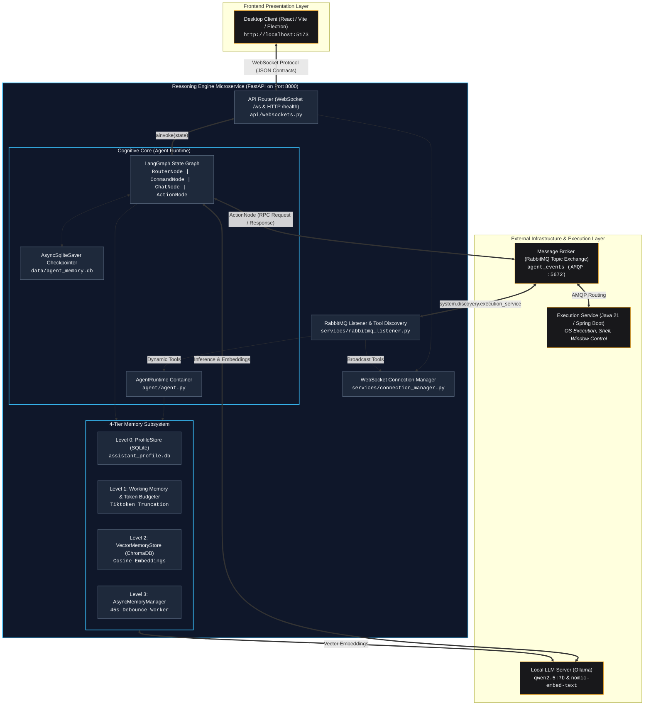

# JARVIS Reasoning Engine (Python Cognitive Core)

The **Reasoning Engine** is the central cognitive microservice (the "Brain") of the JARVIS Agentic Desktop Assistant. It orchestrates user intent understanding, stateful multi-turn reasoning, multi-tier memory synthesis, and real-time tool dispatching between the user interface and local OS execution environments.

---

## 1. Overview & System Role

In the JARVIS decoupled microservice ecosystem, the Reasoning Engine operates as the bridge between perception and action:

* **Inbound Interface (Frontend Interaction)**: Consumes streaming audio transcripts and conversational user prompts from the frontend client ([desktop-client](../desktop-client/)) over persistent, bidirectional WebSockets.
* **Cognitive Runtime (LLM & State Machine)**: Executes stateful reasoning and tool-calling decisions locally using Ollama (`qwen2.5:7b`), governed by a deterministic directed acyclic state graph built on [LangGraph](https://github.com/langchain-ai/langgraph).
* **Autonomous Memory**: Retains user profile parameters, active dialogue context, and semantic memories across restarts via a 4-Tier Memory Subsystem backed by SQLite and ChromaDB.
* **Outbound Execution (OS Automation)**: Dispatches non-blocking Remote Procedure Calls (RPC) across an asynchronous RabbitMQ message bus to the **Java Execution Service**, which enforces local operating system commands, desktop automation, and safety policies.

---

## 2. High-Level System Architecture

The following diagram illustrates the interaction boundaries, network protocols, and internal components of the Reasoning Engine:



---

## 3. Real-Time Communication Protocol (WebSocket & HTTP API)

Frontend clients communicate with the Reasoning Engine via a full-duplex WebSocket connection. All payloads follow a strict tagged-union JSON structure keyed by `"type"`.

### 3.1 Endpoint Specifications

| Protocol | Path | Purpose | Authentication / Security |
| :--- | :--- | :--- | :--- |
| **WS** | `ws://localhost:8000/ws` | Real-time conversational streaming, status signals, and tool discovery updates. | Origin validation enforced via `ALLOWED_ORIGINS`. |
| **HTTP** | `GET http://localhost:8000/health` | Health check endpoint returning engine status (`ONLINE` / `STARTING`) and active tools. | CORS-protected. |

#### HTTP Health Check Response (`GET /health`)

```json
{
  "status": "ONLINE",
  "engine": "JARVIS Qwen 2.5 7B",
  "tools_count": 3,
  "tools": ["open_application", "take_screenshot", "execute_terminal_command"]
}
```

---

### 3.2 Inbound Message Contracts (Client → Server)

#### 1. Heartbeat Ping (`ping`)
Maintains the WebSocket connection alive and checks round-trip latency.
```json
{
  "type": "ping"
}
```

#### 2. User Prompt (`user_message`)
Dispatched by the frontend when the user inputs a conversational or command query (either typed or transcribed via speech-to-text).
```json
{
  "type": "user_message",
  "content": "Abre Visual Studio Code y crea un nuevo branch llamado feature/login."
}
```

---

### 3.3 Outbound Message Contracts (Server → Client)

#### 1. Connection Handshake (`connected`)
Emitted immediately upon accepting the client connection. Supplies initial system greeting and currently registered tools.
```json
{
  "type": "connected",
  "message": "Sistemas de J.A.R.V.I.S en línea y listos para interactuar.",
  "tools": [
    "open_application",
    "take_screenshot",
    "execute_terminal_command"
  ]
}
```

#### 2. Heartbeat Acknowledgment (`pong`)
Returned immediately in response to an inbound `ping`.
```json
{
  "type": "pong"
}
```

#### 3. Agent Processing State (`status`)
Broadcasts transitions in the agent cognitive lifecycle to allow the frontend to render reactive UI states (such as HUD animations, glowing indicators, or thinking spinners).
```json
{
  "type": "status",
  "state": "THINKING"
}
```
*Possible `state` values:*
* `"THINKING"`: The LangGraph state machine is processing nodes, querying Ollama, or awaiting RabbitMQ tool responses.
* `"IDLE"`: Turn completed; engine is awaiting the next user interaction.

#### 4. Assistant Response (`assistant_message`)
The synthesized conversational text produced by the agent to be displayed in the chat interface or passed to text-to-speech (TTS).
```json
{
  "type": "assistant_message",
  "content": "He abierto Visual Studio Code y creado la rama 'feature/login' exitosamente, señor."
}
```

#### 5. Dynamic Tool Inventory Update (`tools_updated`)
Broadcast to all active clients whenever the Java Execution Service advertises or updates available system tools across RabbitMQ.
```json
{
  "type": "tools_updated",
  "tools": [
    "open_application",
    "close_application",
    "take_screenshot",
    "execute_terminal_command"
  ]
}
```

---

### 3.4 Client Interaction Sequence

```
Client                             Reasoning Engine (FastAPI)               LangGraph / Ollama
  │                                           │                                      │
  │─── WebSocket Connect ────────────────────>│                                      │
  │<── {"type": "connected", "tools": [...]}──│                                      │
  │                                           │                                      │
  │─── {"type": "user_message", "content"}───>│                                      │
  │<── {"type": "status", "state":"THINKING"}─│                                      │
  │                                           │─── ainvoke(state, config) ──────────>│
  │                                           │                                      │ (Reasoning, Tool
  │                                           │                                      │  Calls, Summarization)
  │                                           │<── Final Agent State ────────────────│
  │<── {"type": "assistant_message"}──────────│                                      │
  │<── {"type": "status", "state":"IDLE"}─────│                                      │
  │                                           │                                      │
  │─── {"type": "ping"}──────────────────────>│                                      │
  │<── {"type": "pong"}───────────────────────│                                      │
```

---

## 4. Layered Directory Architecture

The microservice strictly adheres to Layered Architecture principles, separating transport controllers, service factories, domain logic, and persistence stores:

```
reasoning-engine/
├── api/                            # Transport layer (FastAPI routes)
│   ├── __init__.py                 # Router exports
│   └── websockets.py               # WebSocket endpoint & Message Dispatcher pattern
├── services/                       # Application & integration services
│   ├── __init__.py                 # Service exports
│   ├── connection_manager.py       # Active WebSocket session registry & broadcasts
│   └── rabbitmq_listener.py        # RabbitMQ tool discovery consumer & OpenAI converter
├── agent/                          # Cognitive orchestration layer (LangGraph)
│   ├── README.md                   # Detailed Agent Orchestrator documentation
│   ├── agent.py                    # AgentRuntime container & graph assembly
│   ├── models.py                   # Canonical Pydantic contracts (EventEnvelope, AgentState)
│   ├── prompts.py                  # System prompts (Router, Chat, Command, Summarize)
│   ├── nodes/                      # Single-responsibility graph nodes
│   │   ├── base.py                 # BaseAgentNode abstract class
│   │   ├── router.py               # RouterNode (Intent classification & semantic RAG)
│   │   ├── chat.py                 # ChatNode (Direct conversational synthesis)
│   │   ├── command.py              # CommandNode (Tool-calling reasoning)
│   │   ├── action.py               # ActionNode (RabbitMQ RPC client dispatcher)
│   │   ├── summarize.py            # SummarizeNode (Human synthesis of tool results)
│   │   └── routing.py              # Conditional edge routers (route_intent, should_use_tools)
│   └── memory/                     # 4-Tier Memory Subsystem
│       ├── README.md               # Detailed Memory Subsystem documentation
│       ├── models.py               # MemoryItem & Category schemas
│       ├── profile_store.py        # Level 0: SQLite Key-Value profile store
│       ├── short_term.py           # Level 1: Working memory & Tiktoken budgeter
│       ├── vector_store.py         # Level 2: ChromaDB cosine vector space
│       ├── async_manager.py        # Level 3: Background debounce consolidation worker
│       └── context_assembler.py    # Multi-tier context synthesis utility
├── data/                           # Local persistence storage (Generated at runtime)
│   ├── agent_memory.db             # LangGraph thread checkpointer SQLite database
│   ├── assistant_profile.db        # Level-0 Profile store SQLite database
│   └── chroma_db/                  # Level-2 ChromaDB vector index directory
├── tests/                          # Automated unit and integration test suite
│   ├── test_server.py              # API, WebSockets, Dispatcher, and CORS tests
│   ├── test_nodes.py               # LangGraph nodes and intent routing tests
│   ├── test_async_manager.py       # Memory consolidation tests
│   ├── test_vector_store.py        # ChromaDB vector store tests
│   └── ...                         # Additional memory and integration tests
├── config.py                       # Pydantic Settings configuration (CORS, HOST, PORT)
├── .env.example                    # Environment variable configuration template
├── rabbitmq.py                     # Asynchronous aio-pika RabbitMQ RPC client
├── requirements.txt                # Pinned production and testing dependencies
└── main.py                         # Application entrypoint & FastAPI Lifespan manager
```

---

## 5. Requirements & Environment Setup

### 5.1 System Prerequisites

Before launching the Reasoning Engine, verify the following dependencies are installed and active:

1. **Python 3.10+** (Recommended: Python 3.11).
2. **RabbitMQ Broker**:
   * Must be listening on port `5672` (Default guest credentials: `guest:guest`).
   * Managed via Docker:
     ```bash
     docker run -d --name rabbitmq -p 5672:5672 -p 15672:15672 rabbitmq:3-management
     ```
3. **Ollama Instance**:
   * Must be running locally on `http://localhost:11434`.
   * Ensure required models are pulled:
     ```bash
     ollama pull qwen2.5:7b
     ollama pull nomic-embed-text
     ```

---

### 5.2 Environment Configuration (`.env`)

The service loads settings via [config.py](./config.py) backed by `pydantic-settings`. 

Create a `.env` file from the provided template:

```powershell
# Windows PowerShell
copy .env.example .env
```

```bash
# Linux / macOS
cp .env.example .env
```

#### Supported Configuration Variables

| Variable | Type | Default | Description |
| :--- | :--- | :--- | :--- |
| `HOST` | String | `0.0.0.0` | Network binding interface. |
| `PORT` | Integer | `8000` | Port on which the HTTP/WebSocket server listens. |
| `ALLOWED_ORIGINS` | Comma-separated or JSON list | `http://localhost:5173,http://127.0.0.1:5173` | Allowed CORS origins (must match your Vite desktop client URL). |

---

## 6. Execution & Operational Guide

> [!NOTE]
> **Planned Feature (One-Click Launcher)**: An automated startup script or standalone executable will be introduced soon to streamline full-stack orchestration (verifying infrastructure prerequisites, spinning up Docker containers, and launching the reasoning engine and desktop client in a single step). For now, follow the standard execution steps detailed below.

### 6.1 Virtual Environment Setup

Isolate Python packages within a local virtual environment:

```powershell
# 1. Create and activate virtual environment (Windows)
python -m venv .venv
.\.venv\Scripts\Activate.ps1

# 2. Upgrade package manager and install dependencies
python -m pip install --upgrade pip
pip install -r requirements.txt
```

---

### 6.2 Running the Server

#### Standard Production / Local Mode
Launch the unified server via [main.py](./main.py):

```powershell
python main.py
```

#### Development Mode with Hot Reload
To enable automatic code reloading during development:

```powershell
uvicorn main:app --host 0.0.0.0 --port 8000 --reload
```

Upon successful startup, the server initializes the agent runtime, connects to RabbitMQ, binds SQLite checkpointers, and displays:

```text
🔌 [Server] Initializing Reasoning Engine and dependent services...
✅ [Server] LangGraph Engine and WebSockets ready on http://0.0.0.0:8000
```

---

### 6.3 Running Automated Tests

The test suite validates state injection, API routers, CORS policies, WebSocket message dispatchers, memory consolidation, and graph node transitions:

```powershell
# Execute the complete pytest test suite
python -m pytest

# Run with verbose output and test execution durations
python -m pytest -v --durations=5
```

---

## 7. Deep Dives & Architectural Documentation

For deep technical specifications on specific subsystems, consult the dedicated package documentation:

* **[Agent Orchestrator & State Machine Architecture (agent/README.md)](./agent/README.md)**:
  * LangGraph topology and invariants.
  * Node responsibilities (`RouterNode`, `CommandNode`, `ChatNode`, `ActionNode`, `SummarizeNode`).
  * System prompts, prompt engineering rules, and ReAct tool-calling loops.
* **[4-Tier Autonomous Memory Subsystem (agent/memory/README.md)](./agent/memory/README.md)**:
  * Level 0: Deterministic SQLite Profile Store.
  * Level 1: Short-term dialogue token budgeting and tool call block atomicity.
  * Level 2: ChromaDB cosine semantic memory retrieval (RAG).
  * Level 3: Asynchronous debounce consolidation lifecycle worker.
* **[Event-Driven Messaging Specification (docs/messaging/rabbitmq-spec.md)](../docs/messaging/rabbitmq-spec.md)**:
  * RabbitMQ topic exchange topology and routing keys.
  * Asynchronous RPC execution contracts and correlation ID tracing.
  * Pydantic serialization schemas and camelCase/snake_case mapping.