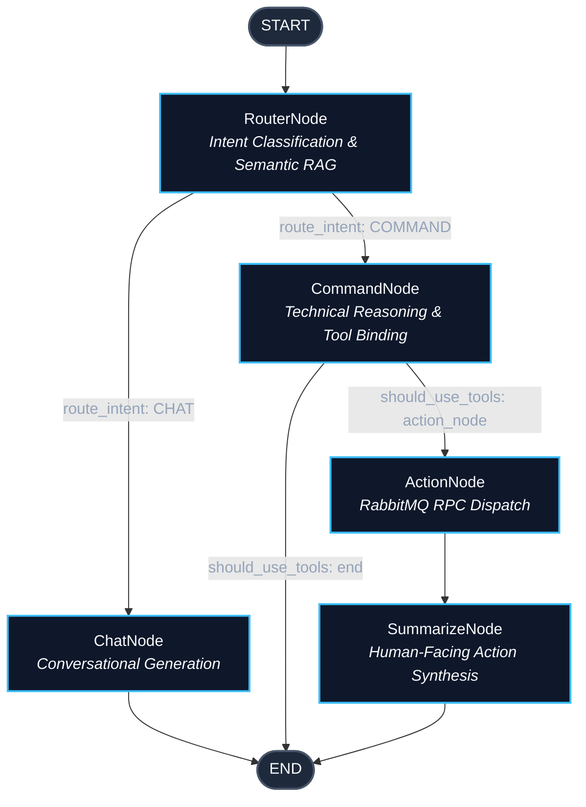

# Agent Orchestrator & Workflow Architecture (`reasoning-engine/agent`)

The `agent` package constitutes the cognitive execution engine of the Jarvis Desktop Assistant. Built upon [LangGraph](https://github.com/langchain-ai/langgraph), it orchestrates multi-turn conversational dialogue, technical tool execution, distributed RPC messaging, and multi-tier memory synthesis through a deterministic, state-driven workflow graph.

---

## 1. Orchestrator Architecture (LangGraph Topology)

The orchestrator models conversational reasoning and tool execution as a directed acyclic state machine (DAG), ensuring deterministic execution boundaries and preventing unbounded cyclic hallucinations.



### Topology Flow & Invariants

1. **Entry Point (`START -> RouterNode`)**: Every execution begins at `RouterNode`, which inspects the last user message, classifies conversational intent (`CHAT` vs. `COMMAND`), and selectively retrieves Level-2 vector memories.
2. **Branching via `route_intent`**:
   - **`CHAT`**: Traverses directly to `ChatNode`, which produces a conversational response with full memory context and routes to `END`.
   - **`COMMAND`**: Traverses to `CommandNode`, which binds external tool schemas to the model and prompts it to generate structured execution calls.
3. **Tool Execution Branching via `should_use_tools`**:
   - If `CommandNode` emits an `AIMessage` containing `tool_calls`, the flow proceeds to `ActionNode` -> `SummarizeNode` -> `END`.
   - If no tool invocation is required (e.g., clarifying question or direct technical response), the flow routes directly to `END`.
4. **Deterministic Termination**: The graph contains no back-edges or cyclic re-prompting loops, strictly bounding execution cost and latency per user interaction turn.

---

## 2. Global State Management (`AgentState`)

Agent state transitions are governed by `AgentState`, a typed schema defined in [models.py](./models.py):

```python
class AgentState(TypedDict, total=False):
    messages: Annotated[Sequence[BaseMessage], operator.add]
    intent: Optional[str]
    correlation_id: Optional[str]
    retrieved_memories: Optional[List[Dict[str, Any]]]
```

### Key Design Highlights:
* **Append-Only Reducer (`operator.add`)**: By annotating `messages` with `operator.add`, LangGraph applies an incremental reducer. Nodes return only *new* messages (e.g., `{"messages": [AIMessage(...)]}`), which LangGraph concatenates to the existing history rather than overwriting it.
* **Distributed Traceability (`correlation_id`)**: A unique UUID/string tracking the conversation across distributed microservices.
* **Transient RAG Payload (`retrieved_memories`)**: Populated by `RouterNode` during initial classification, passing semantic memories through the state pipeline without requiring redundant vector queries downstream.

---

## 3. Dependency Container & Lifecycle (`AgentRuntime`)

To adhere to enterprise-grade software architecture and eliminate **import-time side effects** and **global mutable state**, all dependencies are assembled using the **Dependency Container Pattern** via `AgentRuntime` and `create_agent_runtime`:

```python
@dataclass
class AgentRuntime:
    graph: StateGraph
    mq_client: RabbitMQClient
    profile_store: ProfileStore
    vector_store: VectorMemoryStore
    memory_manager: AsyncMemoryManager
    session_summarizer: SessionSummarizer
    dynamic_tools: List[Dict[str, Any]] = field(default_factory=list)
    llm: Optional[BaseChatModel] = None

    async def initialize(self) -> None:
        """Initialize messaging connections and persistent memory stores."""
        await self.mq_client.connect()
        await self.profile_store.initialize()
        await self.vector_store.initialize()

    async def close(self) -> None:
        """Flush pending background memories and cleanly close all active connections."""
        await self.memory_manager.flush_and_close()
        await self.profile_store.close()
        await self.mq_client.close()
```

### Architecture Benefits
* **Zero Import-Time Side Effects**: Importing `agent` or its submodules executes zero network calls, creates no SQLite files, and allocates no background worker threads.
* **Pure Testability & Isolation**: Tests can instantiate completely isolated runtimes with in-memory databases (`:memory:`), mock clients, and isolated ChromaDB directories without cross-test contamination.
* **Explicit Lifecycle Management**: Top-level entrypoints (`server.py`, `service.py`, `main.py`) manage connection startup and graceful shutdown via explicit `runtime.initialize()` and `runtime.close()` calls (e.g., inside FastAPI's `lifespan`).
* **Context Window Budgeting (`DEFAULT_LLM_NUM_CTX = 8192`)**: Local Ollama instances default to a 2,048-token context window if unspecified. The runtime explicitly configures `num_ctx=8192`, preventing silent prompt truncation when combining the system persona, Level-0 profile facts, Level-2 RAG memories, and the 3,000-token dialogue budget.

---

## 4. Shared Base Node Abstraction (`BaseAgentNode`)

To enforce the **DRY (Don't Repeat Yourself)** principle and promote clean inheritance, all conversational nodes (`ChatNode`, `CommandNode`, `SummarizeNode`) inherit from [BaseAgentNode](./nodes/base.py).

```
          ┌───────────────────────────┐
          │       BaseAgentNode       │
          ├───────────────────────────┤
          │ - _llm                    │
          │ - _profile_store          │
          │ - _session_summarizer     │
          │ - _vector_store           │
          │ - _memory_manager         │
          │ - _system_prompt          │
          │ - _max_dialogue_tokens    │
          ├───────────────────────────┤
          │ + _assemble_context()     │
          │ + _record_turn()          │
          └─────────────┬─────────────┘
                        │
       ┌────────────────┼────────────────┐
       ▼                ▼                ▼
  ┌──────────┐   ┌─────────────┐   ┌───────────────┐
  │ ChatNode │   │ CommandNode │   │ SummarizeNode │
  └──────────┘   └─────────────┘   └───────────────┘
```

### Encapsulated Capabilities:
* **Dependency Injection**: Consolidates the 5 memory subsystems and model configuration in a single constructor.
* **Context Assembly (`_assemble_context`)**: Queries `ProfileStore` and `SessionSummarizer`, formats semantic vector memories, trims dialogue history to `DEFAULT_MAX_DIALOGUE_TOKENS`, and delegates to `ContextAssembler.assemble()`.
* **Turn Recording (`_record_turn`)**: Extracts the last human message and assistant response text, dispatching them to `AsyncMemoryManager.record_turn()` to reset the 45-second debounce cooldown for background memory consolidation.

---

## 5. Functional Nodes (The Actors)

Every node in the graph embodies the **Single Responsibility Principle (SRP)**:

### `RouterNode`
* **Role**: Zero-shot semantic intent classifier and conditional retrieval gateway.
* **Mechanism**: Invokes the LLM with `ROUTER_PROMPT` to classify the user's message as either `CHAT` or `COMMAND`.
* **Optimization**: Evaluates the input against `is_simple_greeting_or_trivial()`. Non-substantive messages (greetings, courtesies, acknowledgements) bypass ChromaDB semantic search entirely, reducing vector retrieval overhead to zero for trivial turns.

### `ChatNode`
* **Role**: General conversational turn generator.
* **Mechanism**: Inherits from `BaseAgentNode`. Constructs the full 4-tier memory context (system persona, profile facts, retrieved memories, trimmed dialogue) and invokes the conversational LLM.
* **Turn Persistence**: Immediately logs both the human turn and assistant turn to `AsyncMemoryManager`.

### `CommandNode`
* **Role**: Technical reasoning and tool invocation strategist.
* **Mechanism**: Binds dynamic tool schemas (`tools`) received from the execution service using `ChatOllama.bind_tools()`. 
* **Model Steering**: Enforces strict instructions via `COMMAND_PROMPT` forbidding metric hallucinations. Forces the model to generate structured `tool_calls` in an `AIMessage` rather than fabricating OS metrics.
* **Turn Persistence**: If the model decides no tools are required, records the turn immediately; otherwise, defers turn recording until tool execution completes.

### `ActionNode`
* **Role**: Distributed boundary between LLM reasoning and physical OS execution.
* **Mechanism**: Iterates over `AIMessage.tool_calls`, translates each into a strongly typed `ToolExecutionRequestPayload`, wraps it inside an `EventEnvelope` with a unique correlation ID, and dispatches it over RabbitMQ via RPC (`send_and_wait`).
* **Resilience**: Contains explicit type validation (`TypeError`), null-safety guards against RPC timeouts, and formats responses into standard LangChain `ToolMessage` instances.

### `SummarizeNode`
* **Role**: Technical result translator and conversational closer.
* **Mechanism**: Takes the raw tool outputs collected by `ActionNode` (JSON logs, status codes, terminal outputs) and synthesizes a concise, elegant, human-friendly confirmation aligned with the Jarvis persona (`SUMMARIZE_PROMPT`).
* **Turn Persistence**: Records the completed technical cycle into `AsyncMemoryManager` for background learning.

---

## 6. Conditional Edge Routing (`routing.py`)

Routing decisions are decoupled from node implementations in [routing.py](./nodes/routing.py):

* **`route_intent(state: AgentState)`**:
  Reads `state["intent"]`. Returns `NodeName.COMMAND.value` if classified as `Intent.COMMAND`, otherwise `NodeName.CHAT.value`.
* **`should_use_tools(state: AgentState)`**:
  Inspects the final message in `state["messages"]`. If it is an `AIMessage` containing non-empty `tool_calls`, routes to `NodeName.ACTION.value`. If no tools were invoked, routes to `NodeName.END.value`. Prevents empty RPC executions and invalid state transitions.

Both functions leverage strongly typed `NodeName(str, Enum)` and `Intent(str, Enum)` enumerations, eliminating magic string typos across graph definitions.

---

## 7. Event-Driven Messaging Contracts (`models.py`)

Inter-service communication between the Python Reasoning Engine and the Java Execution Service is governed by strict Pydantic schemas in [models.py](../agent/models.py):

```
┌────────────────────────────────────────────────────────┐
│                     EventEnvelope                      │
├────────────────────────────────────────────────────────┤
│ metadata: EventMetadata                                │
│   - eventId: UUID string                               │
│   - correlationId: Tool call tracing UUID              │
│   - timestamp: Millisecond epoch                       │
│   - source: "reasoning-engine"                         │
│   - eventType: EXECUTION_REQUEST                       │
├────────────────────────────────────────────────────────┤
│ payload: Dict[str, Any]                                │
│   - toolName: str (e.g., "kill_process", "sys_stats")  │
│   - arguments: Dict[str, Any] (e.g., {"pid": 1234})    │
└────────────────────────────────────────────────────────┘
```

### Distributed Tracing & Correlation
* `correlationId` links each individual LLM `tool_call["id"]` directly to the execution request and response envelopes across RabbitMQ queues.
* Strict schema validation ensures zero serialization mismatches across language boundaries (Python <-> Java).

---

## 8. Prompts, Boundaries, and Heuristics

### Persona & Veracity Governance ([prompts.py](./prompts.py))
* **Critical Truthfulness Constraint (`REGLA CRÍTICA DE VERACIDAD`)**: Prompt instructions explicitly forbid the assistant from hallucinating system metrics (CPU, RAM, open ports, process trees). If an operational query is requested, the model is strictly bound to execute tools first.
* **Atomic Immutability**: All prompt strings are annotated as `typing.Final[str]` and exported cleanly.

### High-Performance Heuristics ([utils.py](./utils.py))
* **Zero-Allocation Filtering**: Common conversational phrases ("hola", "gracias", "ok", "adiós", etc.) are stored in an immutable, module-level `frozenset` (`TRIVIAL_CONVERSATIONAL_PHRASES`). This eliminates heap allocation overhead on every user interaction turn.
* **Token Economy**: Bypasses costly RAG embedding generation and vector search when messages are shorter than `MIN_TRIVIAL_CHAR_LENGTH = 4` or match trivial patterns.
* **Robust Multipart Extraction**: `extract_last_human_text` safely parses both standard string content and complex multimodal/dictionary payload blocks (`[{"type": "text", "text": "..."}]`).

---

## 9. Verification and Test Suite

The entire `agent` module is validated via comprehensive automated unit tests in `tests/test_nodes.py`:

```powershell
# Run the node orchestrator and runtime test suite
.\.venv\Scripts\python.exe -m pytest tests/test_nodes.py
```

| Test Function | Coverage Domain |
| :--- | :--- |
| `test_prompts_integrity` | Verifies prompt presence, persona rules, and veracity constraints. |
| `test_models_schema` | Validates Pydantic serialization, aliases, and `AgentState` schemas. |
| `test_utils_heuristics` | Tests trivial greeting detection and multipart text extraction. |
| `test_routing_functions` | Verifies `route_intent` and `should_use_tools` conditional edges. |
| `test_router_node` | Tests zero-shot classification and conditional RAG bypass. |
| `test_chat_node` | Validates memory context assembly and turn persistence in chat turns. |
| `test_command_node_with_tools` | Verifies dynamic tool schema binding and `tool_calls` generation. |
| `test_action_node` | Tests RPC dispatching, error wrapping, and response collection. |
| `test_action_node_validation_and_null_safety` | Verifies `TypeError` on invalid states and graceful RPC timeout handling. |
| `test_summarize_node` | Validates conversational synthesis of technical tool outputs. |
| `test_agent_graph_factory` | Verifies node registration and edge compilation in `create_agent_graph`. |
| `test_agent_runtime_factory_and_lifecycle` | Validates isolated runtime bootstrapping, DI, and `initialize()`/`close()`. |
