# Multi-Tier Autonomous Memory Engine (`reasoning-engine/memory`)

A production-grade, multi-tier memory subsystem designed for agentic desktop assistants. It provides deterministic profile management, short-term conversational working memory, semantic long-term retrieval (RAG), and zero-contention background memory consolidation.

---

## 1. 4-Tier Memory Architecture

The memory engine organizes knowledge into four distinct logical and physical tiers, strictly separating responsibilities according to data volatility, retrieval semantics, and computational cost:

```
┌────────────────────────────────────────────────────────────────────────┐
│                        4-TIER MEMORY SUBSYSTEM                         │
├────────────────────────────────────────────────────────────────────────┤
│  Level 0: Deterministic Profile Store (SQLite Key-Value)               │
│  - Stable user preferences, system environment, fixed facts.           │
│  - Exact-match retrieval with atomic UPSERT semantics.                 │
├────────────────────────────────────────────────────────────────────────┤
│  Level 1: Working Memory & Session Summarization                       │
│  - Strict token budgeting via Tiktoken (cl100k_base) with fallback.    │
│  - Tool call block atomicity protection & recursive summarization.     │
├────────────────────────────────────────────────────────────────────────┤
│  Level 2: Semantic Long-Term Memory (ChromaDB + Cosine Vector Space)   │
│  - Cross-session memory persistence with Ollama embeddings.            │
│  - Probabilistic RAG retrieval with importance & recency ranking.      │
├────────────────────────────────────────────────────────────────────────┤
│  Level 3: Asynchronous Background Lifecycle Manager                    │
│  - Zero-contention debounce cooldown execution (45s inactivity).       │
│  - Pre-LLM heuristic filtering & full CRUD memory consolidation.       │
└────────────────────────────────────────────────────────────────────────┘
```

### Tier Breakdown

* **Tier 0 (Deterministic Profile Store - `ProfileStore`):**
  Built on asynchronous SQLite (`aiosqlite`). Stores stable, non-probabilistic user preferences, environment metadata, and configuration parameters (e.g., user name, preferred shell, active IDE paths). Operates deterministically via atomic key-value `UPSERT` transactions without semantic drift.

* **Tier 1 (Working Memory & Token Budgeting - `SessionSummarizer` & `trim_messages_token_budget`):**
  Maintains the active conversational context window within strict token limits (default: 3,000 tokens). Accurately calculates message and tool call overhead using `tiktoken` (or a character-ratio fallback). Guarantees **tool invocation atomicity**, ensuring an `AIMessage` with `tool_calls` is never separated from its subsequent `ToolMessage` results during context trimming.

* **Tier 2 (Semantic Long-Term Memory - `VectorMemoryStore`):**
  Persists cross-session factual memories in a local ChromaDB vector store backed by `nomic-embed-text` embeddings via Ollama. Executes semantic similarity search using cosine distance with configurable similarity thresholds and metadata filtering (category, project tag, importance).

* **Tier 3 (Asynchronous Lifecycle Manager - `AsyncMemoryManager`):**
  A background orchestrator that silently ingests conversation turns, monitors user idle time, and invokes a secondary LLM (`qwen2.5:7b`) to extract, update, or prune persistent facts across Tier 0 and Tier 2 without blocking the main event loop.

---

## 2. End-to-End Execution Flow

```mermaid
sequenceDiagram
    autonumber
    actor User as User
    participant Orchestrator as Orchestrator (agent.py)
    participant Assembler as ContextAssembler
    participant Background as AsyncMemoryManager
    participant DB as Storage (Tier 0 & Tier 2)
    participant Extractor as Background Extractor (Qwen LLM)

    %% PHASE 1: SYNCHRONOUS INFERENCE FLOW
    rect rgb(30, 41, 59)
    Note over User, Extractor: ── PHASE 1: IMMEDIATE INTERACTION (Synchronous & Low-Latency) ──
    User->>Orchestrator: User prompt / message
    Orchestrator->>Background: record_turn("user", text) [Resets 45s debounce timer]
    Orchestrator->>DB: Query User Profile (Tier 0) & Search Memories (Tier 2 RAG)
    DB-->>Orchestrator: Profile key-values & Top-K Vector memories
    Orchestrator->>Assembler: assemble(base_prompt, history, profile, memories, summary)
    Assembler-->>Orchestrator: Master Context (Consolidated SystemMessage + Trimmed History)
    Orchestrator->>User: Streamed / Generated response from Main LLM
    Orchestrator->>Background: record_turn("assistant", text) [Resets 45s debounce timer]
    end

    %% PHASE 2: ASYNCHRONOUS MEMORY CYCLE
    rect rgb(15, 23, 42)
    Note over User, Extractor: ── PHASE 2: CONTEXT EXTRACTION & CONSOLIDATION (Background / Zero-Contention) ──
    Note over Background: Inactivity window expires (45s of user silence)
    Background->>Background: _is_trivial_block() [Zero-Cost Heuristic Regex Filter]
    alt Conversation contains substantive facts
        Background->>DB: Pre-Extraction Search (Retrieve related memory candidates)
        DB-->>Background: Existing memories with candidate IDs
        Background->>Extractor: ainvoke(EXTRACTION_PROMPT + Dialogue + Candidate IDs)
        Extractor-->>Background: JSON MemoryExtractionPlan (CREATE / UPDATE / DELETE)
        Background->>DB: Execute atomic state mutations (SQLite UPSERT / ChromaDB CRUD)
    else Conversation is trivial (greetings, thanks, short banter)
        Background->>Background: Discard buffer silently (0 inference cost)
    end
    end
```



---

## 3. Implemented Software Engineering & Design Patterns

### 1. Zero-Contention Debounce Pattern
* **Problem:** Extracting memories on every single user turn saturates local GPU inference and degrades user chat responsiveness.
* **Solution:** `AsyncMemoryManager` batches conversation turns in a FIFO queue. Every incoming message resets a 45-second debounce cooldown timer (`asyncio.Task`). Background memory extraction only triggers when the user is idle, guaranteeing zero compute contention while the user is actively chatting.

### 2. Zero-Cost Heuristic Pre-Filtering
* **Problem:** Invoking an LLM on trivial exchanges ("hello", "thanks", "ok", "bye") wastes CPU/GPU cycles and risks creating low-value noise in the vector store.
* **Solution:** Before calling the extractor LLM, `_is_trivial_block()` applies precompiled regular expressions (`re.compile`) against all user turns in the batch. Trivial blocks are discarded at zero computational cost in microseconds.

### 3. Pre-Extraction Contextual Retrieval (Inverse RAG)
* **Problem:** LLMs cannot update or delete memories without knowledge of existing storage identifiers (`memory_id`), leading to duplicate or contradictory vector records.
* **Solution:** Prior to extraction, the manager queries ChromaDB with user messages to find top candidate memories and injects them into the prompt formatted as `[ID: <uuid>] (<category>) <text>`. The extractor can explicitly reference existing IDs for `UPDATE` or `DELETE` operations.

### 4. Semantic Fallback & Deduplication
* **Problem:** An LLM might occasionally omit a `memory_id` when describing a modified fact, or might generate an identical memory item repeatedly.
* **Solution:**
  * **CREATE:** Automatic cosine similarity deduplication check (`score_threshold = 0.85`). If a near-identical memory exists, it is updated in-place rather than duplicated.
  * **UPDATE / DELETE Fallback:** If `memory_id` is missing, an on-the-fly semantic search locates the nearest candidate (`score_threshold = 0.70 - 0.75`) and performs the mutation safely.

### 5. Pure Context Assembler with Dependency Injection
* **Problem:** Tightly coupling prompt formatting with storage layers harms testability and violates single responsibility principles.
* **Solution:** `ContextAssembler.assemble()` is a pure, stateless static method. Storage formatting logic is decoupled via optional callback dependency injection (`memory_store_formatter: Optional[Callable[[Sequence[Any]], str]]`), with a fallback formatter for standalone usage.

### 6. Atomic Tool-Call Block Grouping
* **Problem:** Naive token-based truncation can slice a message list between an `AIMessage(tool_calls=[...])` and its corresponding `ToolMessage`, breaking LLM API validation constraints.
* **Solution:** `group_atomic_message_blocks()` clusters tool invocations and their associated responses into indivisible units before calculating token budgets.

---

## 4. Public API Reference

Below is the interface contract for orchestrators (e.g., `agent.py`):

```python
from memory import (
    ProfileStore,
    VectorMemoryStore,
    AsyncMemoryManager,
    ContextAssembler,
    SessionSummarizer
)

# 1. Initialization
profile_store = ProfileStore(db_path="./data/assistant_profile.db")
vector_store = VectorMemoryStore(persist_directory="./data/chroma_db")
memory_manager = AsyncMemoryManager(
    vector_store=vector_store,
    profile_store=profile_store,
    debounce_seconds=45.0
)
session_summarizer = SessionSummarizer()
```

### Event Ingestion (Fire-and-Forget)
```python
# Record user and assistant dialogue turns (resets background debounce timer)
memory_manager.record_turn(role="user", content="I prefer TypeScript for all scripts.")
memory_manager.record_turn(role="assistant", content="Understood. I will use TypeScript.")

# Flush pending buffers during graceful shutdown
await memory_manager.flush_and_close()
```

### State Retrieval
```python
# Tier 0: Structured profile context
profile_context = await profile_store.format_for_context()

# Tier 1: Session summary context
summary_context = session_summarizer.get_summary_context()

# Tier 2: Semantic long-term memories
retrieved_memories = await vector_store.search_memories(
    query="Which language should I use for scripts?",
    limit=3,
    score_threshold=0.60
)
```

### Master Prompt Assembly
```python
# Consolidates all 4 tiers into a single SystemMessage + trimmed history
assembled_messages = ContextAssembler.assemble(
    base_system_prompt="You are Jarvis, an intelligent desktop assistant.",
    messages=dialogue_history,
    profile_context=profile_context,
    retrieved_memories=retrieved_memories,
    session_summary_context=summary_context,
    max_dialogue_tokens=3000,
    memory_store_formatter=vector_store.format_for_context
)
```

---

## 5. Domain Models & Schemas

Domain entities are strictly typed and validated via Pydantic (`memory/models.py`):

| Model / Enum | Responsibility | Key Attributes |
| :--- | :--- | :--- |
| `MemoryCategory` | Categorical classification of facts | `PREFERENCE`, `PROJECT`, `SYSTEM_CONFIG`, `DECISION`, `FACT` |
| `MemoryOperationType` | Supported memory lifecycle mutations | `CREATE`, `UPDATE`, `DELETE`, `NOTHING` |
| `MemoryItem` | Canonical representation of a stored memory | `id` (UUID4), `text`, `category`, `importance` (1-5), `project`, `created_at`, `last_accessed_at`, `similarity_score` |
| `MemoryOperation` | Atomic mutation requested by background LLM | `op`, `memory_id`, `text`, `category`, `importance`, `project`, `reason` |
| `MemoryExtractionPlan` | Validated container for LLM extraction plans | `operations: List[MemoryOperation]` |
| `UserProfile` | High-level user persona and preferences | `user_name`, `response_style`, `preferences`, `system_environment`, `technical_preferences` |

---

## 6. Storage Specifications

| Storage Layer | Technology | Data Format | Persistence Location |
| :--- | :--- | :--- | :--- |
| **Tier 0 (Profile)** | SQLite (`aiosqlite`) | Relational table (`key`, `category`, `value`, `updated_at`) | `./data/assistant_profile.db` |
| **Tier 2 (Vector)** | ChromaDB (`chromadb`) | Cosine vector index (`hnsw:space: cosine`) + Sanitized metadata | `./data/chroma_db/` |
| **Embeddings** | Ollama Embeddings | 768-dim dense vectors (`nomic-embed-text`) | Local Ollama instance (`:11434`) |

---

## 7. Testing & Quality Assurance

The module is verified via a comprehensive test suite in `reasoning-engine/tests/`:

* `test_async_manager.py`: Validates debounce logic, heuristic pre-filtering, and full CRUD execution (`CREATE`, `UPDATE`, `DELETE`, and candidate memory injection).
* `test_context_assembler.py`: Verifies pure 4-tier prompt assembly, XML boundaries, and fallback formatting.
* `test_short_term.py`: Tests token counting, atomic tool-call block grouping, and dialogue truncation budgets.
* `test_vector_store.py`: Tests ChromaDB initialization, embedding generation, metadata sanitization, and cosine retrieval.
* `test_profile_store.py`: Tests SQLite asynchronous connection bootstrapping, atomic upserts, and serialization.

To execute the test suite:
```powershell
.\.venv\Scripts\python.exe -m pytest
```
